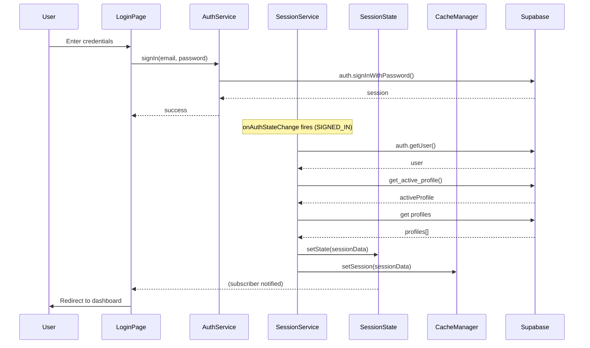
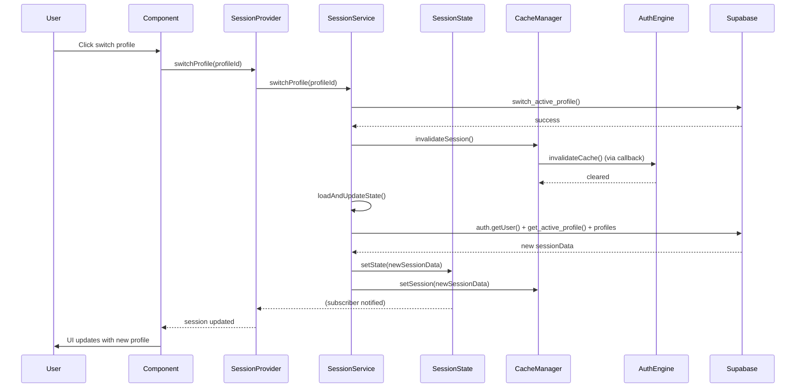
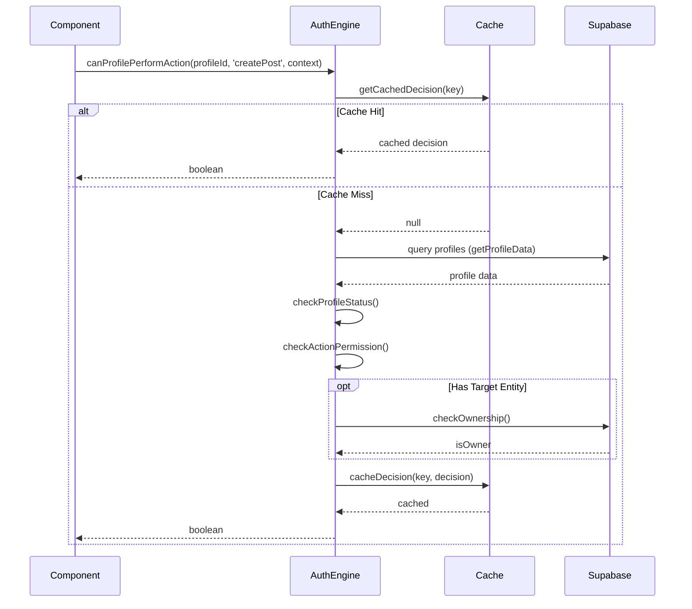
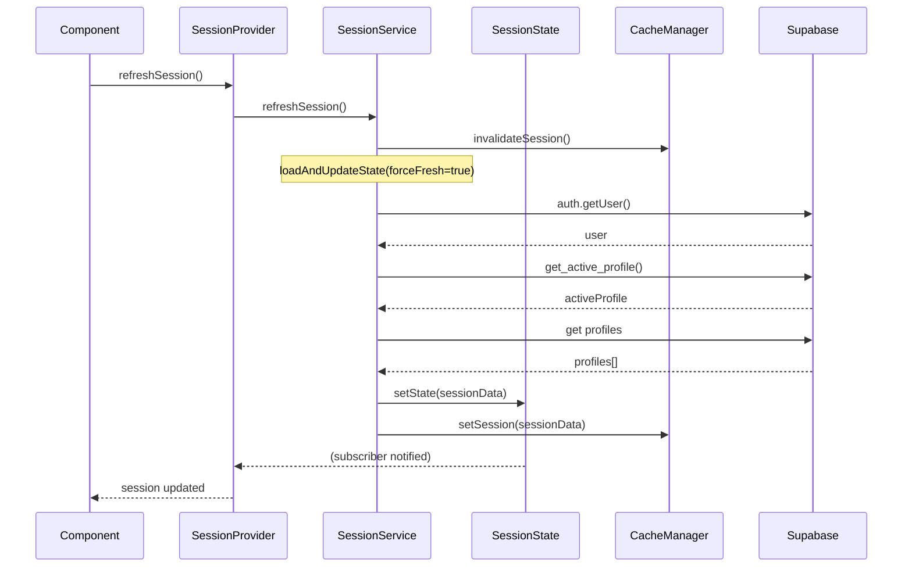

# Design Document: Session Context Centralization

## Overview

Este documento especifica o design técnico para um sistema centralizado de contexto de sessão que substitui o acesso direto e espalhado a dados de usuário/profile no sistema atual. O design estabelece uma arquitetura clara com separação de responsabilidades entre gerenciamento de sessão (Session_Context_System) e autorização (Authorization_Engine).

### Objetivos

1. **Fonte Única de Verdade**: Centralizar acesso a dados de sessão (user, activeProfile, profiles)
2. **Separação de Responsabilidades**: Isolar contexto de sessão de lógica de autorização
3. **Consistência**: Garantir dados consistentes em toda a aplicação
4. **Performance**: Cache eficiente com invalidação apropriada
5. **Manutenibilidade**: Código organizado e fácil de manter

### Princípios Arquiteturais

- **Session_Context_System**: Gerencia APENAS identidade e contexto (SEM permissões)
- **SessionState é SSOT**: SessionState (objeto compartilhado) é a fonte única de verdade em runtime para React e non-React
- **Sincronização Automática**: SessionService gerencia onAuthStateChange e atualiza SessionState (permitido oficialmente)
- **Authorization_Engine**: Sistema SEPARADO para decisões de autorização
- **Ownership NÃO é Autorização Universal**: Ownership é verificado MAS ainda requer validação de action + context
- **Context Influencia Decisões**: Context afeta lógica de autorização (não apenas cache keys)
- **Canonical_Boundary**: Fronteira clara entre user_id (auth/técnico) e profile_id (social/domínio)
- **Cache_Manager**: APENAS otimização de performance (não é fonte de verdade)
- **Ações Explícitas**: Ações semanticamente claras (create, edit, delete) em vez de ambíguas (post, comment)

## Architecture

### High-Level Architecture

```
┌─────────────────────────────────────────────────────────────┐
│                    APPLICATION LAYER                        │
│  ┌──────────────────┐         ┌──────────────────┐         │
│  │  React Components│         │    Services      │         │
│  └────────┬─────────┘         └────────┬─────────┘         │
│           │                            │                    │
└───────────┼────────────────────────────┼────────────────────┘
            │                            │
            ↓                            ↓
┌─────────────────────────────────────────────────────────────┐
│       SESSION CONTEXT LAYER (Identity Only - SSOT)          │
│  ┌──────────────────┐         ┌──────────────────┐         │
│  │ Session_Provider │         │ Service_Gateway  │         │
│  │  (React Layer)   │         │ (Service Layer)  │         │
│  │  Reads from ↓    │         │  Reads from ↓    │         │
│  └────────┬─────────┘         └────────┬─────────┘         │
│           │                            │                    │
│           │    ┌──────────────────┐    │                    │
│           └───→│  SessionState    │←───┘                    │
│                │  ⚡ SSOT Object  │                         │
│                │  (Shared State)  │                         │
│                └────────┬─────────┘                         │
│                         ↑                                   │
│                         │ updates                           │
│                ┌────────┴─────────┐                         │
│                │ SessionService   │                         │
│                │ + onAuthChange   │                         │
│                │ (Officially OK)  │                         │
│                └────────┬─────────┘                         │
│                         │                                   │
│                ┌────────┴─────────┐                         │
│                │ Cache_Manager    │                         │
│                │ (Optimization)   │                         │
│                └──────────────────┘                         │
└───────────────────────┼──────────────────────────────────────┘
                        │
                        ↓
┌─────────────────────────────────────────────────────────────┐
│           AUTHORIZATION LAYER (Separate System)             │
│              ┌──────────────────┐                           │
│              │Authorization_    │                           │
│              │    Engine        │                           │
│              │ (Callback Reg.)  │                           │
│              └────────┬─────────┘                           │
└───────────────────────┼──────────────────────────────────────┘
                        │
                        ↓
┌─────────────────────────────────────────────────────────────┐
│                  DATA LAYER                                 │
│  ┌──────────────────┐         ┌──────────────────┐         │
│  │  Supabase Auth   │         │  Profiles Table  │         │
│  └──────────────────┘         └──────────────────┘         │
└─────────────────────────────────────────────────────────────┘

Key Architectural Decisions:
1. SessionState (shared object) is SSOT for runtime state
2. SessionProvider and ServiceGateway both read from SessionState
3. SessionService manages onAuthStateChange (officially permitted)
4. CacheManager is ONLY performance optimization (not SSOT)
5. Authorization_Engine uses callback registry (no dynamic imports)
6. Context influences authorization decisions (not just cache keys)
7. Ownership checked BUT still requires action + context validation
8. Explicit action semantics (createPost, editPost, deletePost)
```

### Directory Structure

```
src/
├── core/
│   ├── session/                          # Session Context System
│   │   ├── state/
│   │   │   └── SessionState.ts           # Shared SSOT object
│   │   ├── providers/
│   │   │   └── SessionProvider.tsx       # React context provider (reads from SessionState)
│   │   ├── hooks/
│   │   │   └── useSessionContext.ts      # React hook for session access
│   │   ├── services/
│   │   │   ├── SessionService.ts         # Core session management + onAuthStateChange
│   │   │   └── ServiceGateway.ts         # Non-React service access (reads from SessionState)
│   │   ├── cache/
│   │   │   └── CacheManager.ts           # Cache strategy implementation (optimization only)
│   │   ├── errors/
│   │   │   └── index.ts                  # SessionAuthError, ProfileNotFoundError, NoActiveProfileError, CacheError
│   │   ├── types/
│   │   │   └── index.ts                  # Session types
│   │   └── index.ts                      # Public API
│   │
│   ├── authorization/                    # Authorization Engine (Separate)
│   │   ├── services/
│   │   │   └── AuthorizationEngine.ts    # Permission decisions
│   │   ├── errors/
│   │   │   └── index.ts                  # AuthorizationError, OwnershipCheckError
│   │   ├── types/
│   │   │   └── index.ts                  # Authorization types
│   │   └── index.ts                      # Public API
│   │
│   ├── auth/                             # Existing auth (minimal changes)
│   │   └── services/
│   │       └── AuthService.ts            # Keep for auth operations only
│   │
│   └── profiles/                         # Existing profiles (minimal changes)
│       └── services/
│           └── ProfileService.ts         # Keep for profile CRUD only
│
└── integrations/
    └── supabase/
        └── client.ts                     # Supabase client
```


### Component Responsibilities

#### Session_Context_System (`src/core/session/`)

**Responsabilidades**:
- Gerenciar sessão do usuário autenticado
- Gerenciar profile ativo (SSOT em runtime = SessionState)
- Gerenciar lista de profiles disponíveis
- Fornecer operações de troca de profile
- Cache de dados de sessão (APENAS otimização de performance)
- Sincronização automática via Supabase onAuthStateChange (oficialmente permitido em SessionService)
- **NÃO** gerenciar permissões ou autorização

**Componentes**:
- `SessionState`: Objeto compartilhado que é SSOT em runtime (usado por React e non-React)
- `SessionService`: Gerencia onAuthStateChange e atualiza SessionState (única camada permitida)
- `SessionProvider`: React context provider (lê de SessionState)
- `useSessionContext`: Hook para acesso em componentes React
- `ServiceGateway`: Porta de acesso para serviços não-React (lê de SessionState, read-only)
- `CacheManager`: Gerenciamento de cache (APENAS otimização de performance)

**Sincronização Automática**:
- SessionService assina onAuthStateChange (oficialmente permitido)
- Login/logout/refresh atualizam SessionState automaticamente
- SessionProvider e ServiceGateway leem de SessionState
- Não depende de polling ou reload manual
- Cache invalidado automaticamente em mudanças de sessão

#### Authorization_Engine (`src/core/authorization/`)

**Responsabilidades**:
- Decisões de autorização baseadas em profile status + context + ownership
- Verificação de permissões contextuais
- Verificação de ownership de entidades
- Cache de decisões de autorização
- Integração via callback registry (não dynamic imports)
- **NÃO** gerenciar dados de sessão
- **NÃO** usa profile type como critério de autorização (profile type é dado de identidade, não de permissão)

**Componentes**:
- `AuthorizationEngine`: Motor de decisões de autorização
- Tipos e interfaces de autorização
- Callback registry para sincronização com CacheManager

**Regras de Autorização**:
- Ownership NÃO concede autorização universal
- Ownership verificado MAS ainda valida action + context
- Context influencia decisões (não apenas cache keys)
- Exemplo: ser dono de post não significa poder deletar se profile suspenso
- Exemplo: communityId pode restringir ações mesmo para owners

#### Cache_Manager (`src/core/session/cache/`)

**Responsabilidades**:
- Cache em memória de dados de sessão (APENAS otimização de performance)
- Invalidação inteligente baseada em eventos
- Callback registry para propagação de mudanças
- Garantir consistência de dados
- **NÃO** é fonte de verdade (SessionState é SSOT)

**Eventos de Invalidação Completa**:
- Login/logout: limpa TUDO
- Profile switch: limpa profile cache + notifica Authorization_Engine via callback
- Profile update: limpa profile cache + notifica Authorization_Engine via callback
- Role changes: notifica Authorization_Engine via callback (CacheManager.invalidateAuthorization())
- Status changes (suspended, blocked): limpa profile + notifica Authorization_Engine via callback
- Moderator status changes: notifica Authorization_Engine via callback (CacheManager.invalidateAuthorization())
- Ownership changes relevantes: notifica Authorization_Engine via callback (CacheManager.invalidateAuthorization())
- Community settings changes: notifica Authorization_Engine via callback (CacheManager.invalidateAuthorization())

**Operações que Chamam Invalidação de Autorização**:
```typescript
// Role changes (user_roles table)
await supabase.from('user_roles').update({ role: 'moderator' });
CacheManager.invalidateAuthorization(); // Notifica Authorization_Engine

// Status changes (profiles table)
await supabase.from('profiles').update({ is_suspended: true });
CacheManager.invalidateProfile(); // Limpa profile + notifica Authorization_Engine

// Moderator status (community_moderators table)
await supabase.from('community_moderators').insert({ profile_id, community_id });
CacheManager.invalidateAuthorization(); // Notifica Authorization_Engine

// Ownership changes (posts, businesses, etc)
await supabase.from('posts').update({ author_profile_id: newProfileId });
CacheManager.invalidateAuthorization(); // Notifica Authorization_Engine

// Community settings (communities table)
await supabase.from('communities').update({ settings: { allow_createBusiness: false } });
CacheManager.invalidateAuthorization(); // Notifica Authorization_Engine
```

## Components and Interfaces

### Automatic Synchronization Mechanism

**Design Decision**: SessionService manages `onAuthStateChange` and updates SessionState

**Architecture**:
- SessionState is a shared object (SSOT for runtime)
- SessionService subscribes to onAuthStateChange (officially permitted)
- SessionProvider (React) reads from SessionState
- ServiceGateway (non-React) reads from SessionState
- No direct supabase.auth access outside SessionService

**Benefits**:
- Login/logout/refresh reflect automatically
- No manual reload needed
- No polling required
- Real-time updates
- Single source of truth shared between React and non-React
- Consistent with Supabase best practices

**Implementation**:

```typescript
// SessionState - Shared SSOT object
class SessionState {
  private static user: User | null = null;
  private static activeProfile: Profile | null = null;
  private static profiles: Profile[] = [];
  private static listeners: Set<() => void> = new Set();

  static getState(): SessionData {
    return {
      user: this.user,
      activeProfile: this.activeProfile,
      profiles: this.profiles,
    };
  }

  static setState(data: SessionData): void {
    this.user = data.user;
    this.activeProfile = data.activeProfile;
    this.profiles = data.profiles;
    this.notifyListeners();
  }

  static subscribe(listener: () => void): () => void {
    this.listeners.add(listener);
    return () => this.listeners.delete(listener);
  }

  private static notifyListeners(): void {
    this.listeners.forEach(listener => listener());
  }

  static clear(): void {
    this.user = null;
    this.activeProfile = null;
    this.profiles = [];
    this.notifyListeners();
  }
}

// SessionService - Manages onAuthStateChange (ONLY place allowed)
export class SessionService {
  private static initialized = false;
  private static loadVersion = 0;

  /**
   * Increment loadVersion to cancel any in-flight loadAndUpdateState() calls.
   * Must be called before clearing state on SIGNED_OUT.
   */
  private static cancelPendingLoads(): void {
    this.loadVersion++;
  }

  static initialize(): void {
    if (this.initialized) return;
    this.initialized = true;

    // Subscribe to auth state changes (officially permitted here)
    supabase.auth.onAuthStateChange(async (event, session) => {
      if (event === 'SIGNED_OUT') {
        // Cancel any in-flight loads BEFORE clearing state,
        // so a slow concurrent load cannot overwrite the cleared state.
        this.cancelPendingLoads();
        SessionState.clear();
        CacheManager.clearAll();
      } else if (event === 'SIGNED_IN' || event === 'TOKEN_REFRESHED' || event === 'USER_UPDATED') {
        // Must fetch fresh session (bypass cache) for all critical auth events
        await this.loadAndUpdateState(true);
      }
    });

    // Note: Initial session load happens in initializeSession() called by SessionProvider
    // This prevents duplicate loading when SessionProvider calls both initialize() and initializeSession()
  }

  private static async loadAndUpdateState(forceFresh: boolean = false): Promise<void> {
    const version = ++this.loadVersion;
    const sessionData = await this.fetchSessionData(forceFresh);
    if (version !== this.loadVersion) return; // discard stale result
    SessionState.setState(sessionData);
    CacheManager.setSession(sessionData);
  }

  private static async fetchSessionData(forceFresh: boolean = false): Promise<SessionData> {
    // Bypass cache when forceFresh is true (for critical auth events)
    if (!forceFresh) {
      const cached = CacheManager.getSession();
      if (cached) return cached;
    }

    // Load from database (bypasses cache for fresh data)
    const user = await this.getCurrentUser();
    if (!user) {
      return { user: null, activeProfile: null, profiles: [] };
    }

    const [activeProfile, profiles] = await Promise.all([
      this.getActiveProfile(user.id),
      this.getUserProfiles(user.id),
    ]);

    return { user, activeProfile, profiles };
  }

  static async getCurrentUser(): Promise<User | null> {
    // ONLY place in system that calls supabase.auth.getUser()
    const { data: { user }, error } = await supabase.auth.getUser();
    if (error || !user) return null;

    return {
      id: user.id,
      email: user.email!,
      emailConfirmed: !!user.email_confirmed_at,
      createdAt: user.created_at,
    };
  }

  /**
   * Get active profile for user
   */
  static async getActiveProfile(userId: string): Promise<Profile | null> {
    const { data, error } = await supabase
      .rpc('get_active_profile', { p_user_id: userId });

    if (error || !data) {
      return null;
    }

    return this.mapProfileFromDb(data);
  }

  /**
   * Get all profiles for user
   */
  static async getUserProfiles(userId: string): Promise<Profile[]> {
    const { data, error } = await supabase
      .from('profiles')
      .select('*')
      .eq('user_id', userId)
      .order('created_at', { ascending: true });

    if (error || !data) {
      return [];
    }

    return data.map(this.mapProfileFromDb);
  }

  /**
   * Switch active profile
   */
  static async switchProfile(profileId: string): Promise<void> {
    const user = await this.getCurrentUser();
    if (!user) {
      throw new Error('Not authenticated');
    }

    const { error } = await supabase
      .rpc('switch_active_profile', {
        p_user_id: user.id,
        p_profile_id: profileId,
      });

    if (error) {
      throw error;
    }

    // Invalidate cache and reload
    CacheManager.invalidateSession();
    await this.loadAndUpdateState();
  }

  /**
   * Initialize session (called by SessionProvider)
   */
  static async initializeSession(): Promise<void> {
    await this.loadAndUpdateState();
  }

  /**
   * Refresh session (force fresh data)
   */
  static async refreshSession(): Promise<void> {
    // Force bypass cache for fresh data
    CacheManager.invalidateSession();
    await this.loadAndUpdateState(true);
  }

  /**
   * Map database profile to domain model
   */
  private static mapProfileFromDb(dbProfile: any): Profile {
    return {
      id: dbProfile.id,
      userId: dbProfile.user_id,
      name: dbProfile.name,
      displayName: dbProfile.display_name,
      username: dbProfile.username,
      avatarUrl: dbProfile.avatar_url,
      bio: dbProfile.bio,
      profileType: dbProfile.profile_type,
      city: dbProfile.city,
      neighborhood: dbProfile.neighborhood,
      isActive: dbProfile.is_active,
      verified: dbProfile.verified || false,
      createdAt: dbProfile.created_at,
    };
  }
}

```

**Events Handled**:
- `SIGNED_IN`: User logged in → load session and update SessionState
- `SIGNED_OUT`: User logged out → cancel pending loads, then clear SessionState and CacheManager
- `TOKEN_REFRESHED`: Token refreshed → reload session and update SessionState
- `USER_UPDATED`: User data updated → reload session and update SessionState

**Cache Strategy with Fresh Refresh**:
- onAuthStateChange triggers fetchSessionData()
- fetchSessionData() checks cache first for performance
- If cache expired or event requires fresh data, bypasses cache
- Updates SessionState with fresh data
- SessionProvider and ServiceGateway automatically reflect changes

**When Cache is Ignored (Fresh Data Required)**:
```
Events that ALWAYS bypass cache:
- SIGNED_IN: User just logged in → must fetch fresh session
- SIGNED_OUT: User just logged out → must clear state
- TOKEN_REFRESHED: Token was refreshed → must verify session still valid
- USER_UPDATED: User data changed → must fetch updated data

Operations that ALWAYS bypass cache:
- refreshSession(): Explicit user request → force fresh data
- switchProfile(): Profile changed → must fetch new active profile

Cache is used when:
- Initial page load (performance optimization)
- Reading session data without auth events
- TTL not expired (5 minutes default)
```

### Session Context System

#### SessionProvider (React Layer)

```typescript
// src/core/session/providers/SessionProvider.tsx

import React, { createContext, useContext, useState, useEffect } from 'react';
import { SessionState } from '../state/SessionState';
import { SessionService } from '../services/SessionService';
import type { SessionContext } from '../types';

const SessionContext = createContext<SessionContext | undefined>(undefined);

/**
 * SessionProvider - React provider that reads from SessionState (SSOT)
 * 
 * IMPORTANT: SessionState is the single source of truth.
 * This provider subscribes to SessionState changes and re-renders when state updates.
 */
export function SessionProvider({ children }: { children: React.ReactNode }) {
  const [sessionData, setSessionData] = useState(SessionState.getState());
  const [isLoading, setIsLoading] = useState(true);
  const [error, setError] = useState<Error | null>(null);

  useEffect(() => {
    // Initialize SessionService (sets up onAuthStateChange)
    SessionService.initialize();
    
    // Subscribe to SessionState changes
    const unsubscribe = SessionState.subscribe(() => {
      setSessionData(SessionState.getState());
    });

    // Load initial session
    const loadSession = async () => {
      try {
        setIsLoading(true);
        await SessionService.initializeSession();
        setError(null);
      } catch (err) {
        setError(err as Error);
      } finally {
        setIsLoading(false);
      }
    };

    loadSession();

    return unsubscribe;
  }, []);

  const switchProfile = async (profileId: string) => {
    try {
      setIsLoading(true);
      await SessionService.switchProfile(profileId);
    } catch (err) {
      setError(err as Error);
      throw err;
    } finally {
      setIsLoading(false);
    }
  };

  const refreshSession = async () => {
    try {
      setIsLoading(true);
      await SessionService.refreshSession();
    } catch (err) {
      setError(err as Error);
    } finally {
      setIsLoading(false);
    }
  };

  const value: SessionContext = {
    user: sessionData.user,
    activeProfile: sessionData.activeProfile,
    profiles: sessionData.profiles,
    isLoading,
    error,
    switchProfile,
    refreshSession,
  };

  return (
    <SessionContext.Provider value={value}>
      {children}
    </SessionContext.Provider>
  );
}

export function useSessionContext(): SessionContext {
  const context = useContext(SessionContext);
  if (!context) {
    throw new Error('useSessionContext must be used within SessionProvider');
  }
  return context;
}
```

> Note: `useSessionContext` is exported from `src/core/session/hooks/useSessionContext.ts`, not from `SessionProvider.tsx`. The example above shows both in sequence for clarity, but they live in separate files per the directory structure.

#### ServiceGateway (Non-React Access)

```typescript
// src/core/session/services/ServiceGateway.ts

import { SessionState } from '../state/SessionState';
import { NoActiveProfileError } from '../errors';
import type { User, Profile } from '../types';

/**
 * ServiceGateway - Read-only access to session data for non-React services
 * 
 * IMPORTANT: This is READ-ONLY. Mutations (switchProfile, refreshSession) 
 * should ONLY happen through SessionProvider in React layer.
 * ServiceGateway reads directly from SessionState (SSOT).
 */
export class ServiceGateway {
  /**
   * Get current authenticated user
   */
  static getCurrentUser(): User | null {
    return SessionState.getState().user;
  }

  /**
   * Get active profile
   */
  static getActiveProfile(): Profile | null {
    return SessionState.getState().activeProfile;
  }

  /**
   * Get all user profiles
   */
  static getUserProfiles(): Profile[] {
    return SessionState.getState().profiles;
  }

  /**
   * Check if user is authenticated
   */
  static isAuthenticated(): boolean {
    return SessionState.getState().user !== null;
  }

  /**
   * Get required active profile (throws if not found)
   */
  static getRequiredActiveProfile(): Profile {
    const profile = SessionState.getState().activeProfile;
    if (!profile) {
      throw new NoActiveProfileError();
    }
    return profile;
  }
}
```

#### CacheManager (Cache Strategy)

```typescript
// src/core/session/cache/CacheManager.ts

import type { SessionData } from '../types';
import type { CacheInvalidationCallback } from '../types';
import { getCacheConfig } from './CacheConfig';

/**
 * CacheManager - In-memory cache for session data
 * 
 * IMPORTANT: CacheManager is ONLY a performance optimization layer.
 * SessionState is the SINGLE SOURCE OF TRUTH for session state in runtime.
 * 
 * Strategy:
 * - Cache session data in memory for performance (single SessionData object)
 * - SessionState owns the authoritative state
 * - Invalidate on session changes (login, logout, profile switch)
 * - Use callback registry for Authorization_Engine integration (no dynamic imports)
 * - TTL driven by CacheConfig (environment-aware)
 * - No cache for authorization decisions (handled by Authorization_Engine)
 */
export class CacheManager {
  private static sessionCache: SessionData | null = null;
  private static sessionCacheExpiry: number | null = null;
  private static readonly SESSION_TTL = getCacheConfig().session.ttl;

  // Metrics (integrated — no separate CacheMetrics class)
  private static _hits = 0;
  private static _misses = 0;
  private static _invalidations = 0;

  // Callback registry for decoupled integration
  private static invalidationCallbacks: Set<CacheInvalidationCallback> = new Set();

  /**
   * Register callback for cache invalidation events
   * Used by Authorization_Engine to stay in sync
   */
  static registerInvalidationCallback(callback: CacheInvalidationCallback): void {
    this.invalidationCallbacks.add(callback);
  }

  /**
   * Unregister callback
   */
  static unregisterInvalidationCallback(callback: CacheInvalidationCallback): void {
    this.invalidationCallbacks.delete(callback);
  }

  /**
   * Get cached session
   */
  static getSession(): SessionData | null {
    if (!this.sessionCache || !this.sessionCacheExpiry || Date.now() > this.sessionCacheExpiry) {
      this._misses++;
      this.sessionCache = null;
      this.sessionCacheExpiry = null;
      return null;
    }
    this._hits++;
    return this.sessionCache;
  }

  /**
   * Set session cache
   */
  static setSession(session: SessionData): void {
    this.sessionCache = session;
    this.sessionCacheExpiry = Date.now() + this.SESSION_TTL;
  }

  /**
   * Invalidate session cache
   * Called on: login, logout, profile switch, profile update, role changes
   */
  static invalidateSession(): void {
    this._invalidations++;
    this.sessionCache = null;
    this.sessionCacheExpiry = null;

    // Notify registered callbacks (Authorization_Engine, etc)
    this.notifyInvalidation('session');
  }

  /**
   * Invalidate profile-specific cache
   * Called on: profile switch, profile update, status changes
   */
  static invalidateProfile(): void {
    // For now, invalidate entire session
    // In future, could be more granular
    this.invalidateSession();
  }

  /**
   * Invalidate authorization-related cache
   * Called on: role changes, moderator status changes, ownership changes
   */
  static invalidateAuthorization(): void {
    // Notify Authorization_Engine of changes that affect permissions
    this.notifyInvalidation('authorization');
  }

  /**
   * Notify registered callbacks of invalidation
   */
  private static notifyInvalidation(scope: 'session' | 'authorization'): void {
    this.invalidationCallbacks.forEach(callback => {
      try {
        callback(scope);
      } catch (error) {
        console.error('Error in invalidation callback:', error);
      }
    });
  }

  /**
   * Clear all caches (used on logout)
   */
  static clearAll(): void {
    this._invalidations++;
    this.sessionCache = null;
    this.sessionCacheExpiry = null;
    this.notifyInvalidation('session');
  }

  /**
   * Get cache metrics (development/monitoring use only)
   */
  static getMetrics() {
    const total = this._hits + this._misses;
    return {
      hits: this._hits,
      misses: this._misses,
      invalidations: this._invalidations,
      hitRate: total > 0 ? ((this._hits / total) * 100).toFixed(2) + '%' : '0%',
    };
  }
}
```

### Authorization Engine (Separate System)

#### AuthorizationEngine

```typescript
// src/core/authorization/services/AuthorizationEngine.ts

import { supabase } from '@/integrations/supabase';
import { CacheManager } from '@/core/session/cache/CacheManager';
import { getCacheConfig } from '@/core/session/cache/CacheConfig';
import type { 
  Action, 
  ActionContext, 
  TargetEntity, 
  Permission,
  ProfileStatus,
  ProfileType 
} from '../types';

/**
 * AuthorizationEngine - Separate system for authorization decisions
 * 
 * IMPORTANT: This is COMPLETELY SEPARATE from Session_Context_System
 * - Consumes session data but doesn't manage it
 * - Makes authorization decisions based on profile + context + ownership
 * - Caches authorization decisions (separate from session cache)
 * - Ownership does NOT grant universal authorization
 * - Context influences authorization decisions (not just cache keys)
 */
export class AuthorizationEngine {
  private static permissionCache = new Map<string, boolean>();
  private static cacheExpiry = new Map<string, number>();
  private static readonly CACHE_TTL = getCacheConfig().authorization.ttl;
  private static initialized = false;

  /**
   * Initialize Authorization_Engine integration with CacheManager
   * 
   * IMPORTANT: This must be called during application bootstrap.
   * Recommended place: src/main.ts or App.tsx before rendering.
   * Guard prevents duplicate callback registration on hot-reload.
   */
  static initialize(): void {
    if (this.initialized) return;
    this.initialized = true;

    // Register callback for cache invalidation
    CacheManager.registerInvalidationCallback((scope) => {
      if (scope === 'session' || scope === 'authorization') {
        this.invalidateCache();
      }
    });
  }

  /**
   * Main authorization method - ALWAYS use this for decisions
   * 
   * IMPORTANT: Ownership is checked BUT still requires action + context validation
   * Being an owner does NOT automatically grant all permissions
   * 
   * @param profileId - Profile making the action
   * @param action - Action to perform
   * @param context - Context of the action (influences decision, not just cache key)
   * @param targetEntity - Optional target entity for ownership check
   */
  static async canProfilePerformAction(
    profileId: string,
    action: Action,
    context: ActionContext,
    targetEntity?: TargetEntity
  ): Promise<boolean> {
    // Generate cache key
    const cacheKey = this.generateCacheKey(profileId, action, context, targetEntity);
    
    // Check cache
    const cached = this.getCachedDecision(cacheKey);
    if (cached !== null) {
      return cached;
    }

    // Get profile data
    const profile = await this.getProfileData(profileId);
    if (!profile) {
      this.cacheDecision(cacheKey, false);
      return false;
    }

    // Check profile status (suspended profiles denied regardless of ownership)
    if (!this.isProfileAllowed(profile.status)) {
      this.cacheDecision(cacheKey, false);
      return false;
    }

    // Check ownership if target entity provided
    let isOwner = false;
    if (targetEntity) {
      isOwner = await this.checkOwnership(profileId, targetEntity);
    }

    // Check action-specific permissions
    // IMPORTANT: Context influences the decision, not just the cache key
    // Example: communityId in context may restrict actions even for owners
    const canPerform = await this.checkActionPermission(
      profile,
      action,
      context,
      targetEntity,
      isOwner
    );

    this.cacheDecision(cacheKey, canPerform);
    return canPerform;
  }

  /**
   * Check if profile owns/controls target entity
   */
  static async checkOwnership(
    profileId: string,
    targetEntity: TargetEntity
  ): Promise<boolean> {
    const { type, id } = targetEntity;

    switch (type) {
      case 'post':
        return this.checkPostOwnership(profileId, id);
      case 'comment':
        return this.checkCommentOwnership(profileId, id);
      case 'business':
        return this.checkBusinessOwnership(profileId, id);
      case 'message':
        return this.checkMessageOwnership(profileId, id);
      default:
        return false;
    }
  }

  /**
   * Get profile permissions (for UI display ONLY - NOT for decisions)
   * 
   * WARNING: NEVER use this for authorization decisions
   * ALWAYS use canProfilePerformAction() for decisions
   * 
   * Returns two categories:
   * - Global actions: checked without a target entity (creation, moderation, etc.)
   * - Target-dependent actions: marked as 'requiresTarget' — cannot be evaluated
   *   without a specific entity. Use canProfilePerformAction() with targetEntity.
   * 
   * Performance note: this method fetches the profile once and passes it directly
   * to checkActionPermission() via the internal canPerformWithProfile() helper,
   * avoiding the N redundant getProfileData() calls that canProfilePerformAction()
   * would otherwise make for each global action.
   */
  static async getProfilePermissions(
    profileId: string,
    context: ActionContext
  ): Promise<Permission[]> {
    const profile = await this.getProfileData(profileId);
    if (!profile) {
      return [];
    }

    const permissions: Permission[] = [];

    // Global actions — can be evaluated without a target entity
    const globalActions: Action[] = [
      'createPost', 'createComment', 'createMessage', 'createBusiness',
      'moderateContent', 'verifyUser', 'banUser', 'suspendUser',
      'reviewContent', 'voteOnContent', 'uploadMedia', 'reportContent',
    ];

    for (const action of globalActions) {
      // Use internal helper to avoid re-fetching profile on each call
      const canPerform = await this.canPerformWithProfile(profile, action, context);
      permissions.push({ action, status: canPerform ? 'allowed' : 'denied' });
    }

    // Target-dependent actions — ownership required, cannot evaluate without entity
    const targetDependentActions: Action[] = [
      'editPost', 'deletePost',
      'editComment', 'deleteComment',
      'editMessage', 'deleteMessage',
      'editBusiness', 'deleteBusiness',
    ];

    for (const action of targetDependentActions) {
      permissions.push({ action, status: 'requiresTarget' });
    }

    return permissions;
  }

  /**
   * Internal helper: evaluate a permission given an already-loaded profile.
   * Avoids redundant getProfileData() calls when checking multiple actions
   * for the same profile (e.g., inside getProfilePermissions).
   */
  private static async canPerformWithProfile(
    profile: Awaited<ReturnType<typeof AuthorizationEngine.getProfileData>>,
    action: Action,
    context: ActionContext,
    targetEntity?: TargetEntity
  ): Promise<boolean> {
    if (!profile) return false;
    if (!this.isProfileAllowed(profile.status)) return false;

    let isOwner = false;
    if (targetEntity) {
      isOwner = await this.checkOwnership(profile.id, targetEntity);
    }

    return this.checkActionPermission(profile, action, context, targetEntity, isOwner);
  }

  // ============================================================================
  // PRIVATE METHODS
  // ============================================================================

  private static async getProfileData(profileId: string) {
    const { data, error } = await supabase
      .from('profiles')
      .select('id, profile_type, is_active, is_suspended, verified')
      .eq('id', profileId)
      .single();

    if (error || !data) {
      return null;
    }

    return {
      id: data.id,
      type: data.profile_type as ProfileType,
      status: {
        isActive: data.is_active,
        isSuspended: data.is_suspended || false,
        isBlocked: false, // TODO: check banned_users table
      },
      verified: data.verified || false,
    };
  }

  private static isProfileAllowed(status: ProfileStatus): boolean {
    return status.isActive && !status.isSuspended && !status.isBlocked;
  }

  private static async checkActionPermission(
    profile: any,
    action: Action,
    context: ActionContext,
    targetEntity?: TargetEntity,
    isOwner: boolean = false
  ): Promise<boolean> {
    // IMPORTANT: Context influences decisions, not just cache keys
    // Example: communityId may restrict actions based on community rules
    
    // Check if profile is suspended (overrides ownership)
    if (profile.status.isSuspended) {
      return false;
    }

    switch (action) {
      case 'createPost':
      case 'createComment':
      case 'createMessage':
        // Creation requires active status
        return profile.status.isActive;

      case 'editPost':
      case 'editComment':
      case 'editMessage':
        // Editing requires ownership AND active status
        if (!isOwner || !targetEntity) return false;
        return profile.status.isActive;

      case 'deletePost':
      case 'deleteComment':
      case 'deleteMessage':
        // Deletion requires ownership AND active status
        if (!isOwner || !targetEntity) return false;
        return profile.status.isActive;

      case 'createBusiness':
      case 'editBusiness':
      case 'deleteBusiness':
        // Business operations may be restricted by community
        if (context.communityId) {
          const communityAllows = await this.checkCommunityPermission(
            context.communityId,
            action
          );
          if (!communityAllows) return false;
        }
        // Edit/delete require ownership
        if ((action === 'editBusiness' || action === 'deleteBusiness') && !isOwner) {
          return false;
        }
        return profile.status.isActive;

      case 'moderateContent':
      case 'verifyUser':
      case 'banUser':
      case 'suspendUser':
        // Moderation actions require moderator role
        // Context may restrict to specific communities
        const isModerator = await this.isModerator(profile.id);
        if (!isModerator) return false;
        
        if (context.communityId) {
          return await this.isCommunityModerator(profile.id, context.communityId);
        }
        return true;

      case 'reviewContent':
      case 'voteOnContent':
      case 'uploadMedia':
      case 'reportContent':
        return profile.status.isActive;

      default:
        return false;
    }
  }

  private static async checkCommunityPermission(
    communityId: string,
    action: string
  ): Promise<boolean> {
    // Check if community allows this action
    const { data } = await supabase
      .from('communities')
      .select('settings')
      .eq('id', communityId)
      .single();

    if (!data?.settings) return true; // Default allow

    return data.settings[`allow_${action}`] !== false;
  }

  private static async isCommunityModerator(
    profileId: string,
    communityId: string
  ): Promise<boolean> {
    // Check if profile is moderator for specific community
    const { data } = await supabase
      .from('community_moderators')
      .select('id')
      .eq('profile_id', profileId)
      .eq('community_id', communityId)
      .eq('is_active', true)
      .limit(1);

    return !!data && data.length > 0;
  }

  private static async isModerator(profileId: string): Promise<boolean> {
    // Get user_id from profile
    const { data: profile } = await supabase
      .from('profiles')
      .select('user_id')
      .eq('id', profileId)
      .single();

    if (!profile) return false;

    // Check user_roles
    const { data } = await supabase
      .from('user_roles')
      .select('role')
      .eq('user_id', profile.user_id)
      .in('role', ['admin', 'moderator'])
      .eq('is_active', true)
      .limit(1);

    return !!data && data.length > 0;
  }

  private static async checkPostOwnership(profileId: string, postId: string): Promise<boolean> {
    const { data } = await supabase
      .from('posts')
      .select('author_profile_id')
      .eq('id', postId)
      .single();

    return data?.author_profile_id === profileId;
  }

  private static async checkCommentOwnership(profileId: string, commentId: string): Promise<boolean> {
    const { data } = await supabase
      .from('comments')
      .select('author_profile_id')
      .eq('id', commentId)
      .single();

    return data?.author_profile_id === profileId;
  }

  private static async checkBusinessOwnership(profileId: string, businessId: string): Promise<boolean> {
    const { data } = await supabase
      .from('businesses')
      .select('owner_profile_id')
      .eq('id', businessId)
      .single();

    return data?.owner_profile_id === profileId;
  }

  private static async checkMessageOwnership(profileId: string, messageId: string): Promise<boolean> {
    const { data } = await supabase
      .from('messages')
      .select('sender_profile_id')
      .eq('id', messageId)
      .single();

    return data?.sender_profile_id === profileId;
  }

  // Cache management
  private static normalizeContext(context: ActionContext): object {
    return {
      communityId: context.communityId ?? null,
      businessId: context.businessId ?? null,
      eventId: context.eventId ?? null,
    };
  }

  private static normalizeTargetEntity(targetEntity?: TargetEntity): object | null {
    if (!targetEntity) return null;
    return {
      type: targetEntity.type,
      id: targetEntity.id,
    };
  }

  private static generateCacheKey(
    profileId: string,
    action: Action,
    context: ActionContext,
    targetEntity?: TargetEntity
  ): string {
    const parts = [profileId, action, JSON.stringify(this.normalizeContext(context))];
    const normalizedTarget = this.normalizeTargetEntity(targetEntity);
    if (normalizedTarget) {
      parts.push(JSON.stringify(normalizedTarget));
    }
    return parts.join(':');
  }

  private static getCachedDecision(key: string): boolean | null {
    const cached = this.permissionCache.get(key);
    const expiry = this.cacheExpiry.get(key);

    if (cached === undefined || !expiry || Date.now() > expiry) {
      return null;
    }

    return cached;
  }

  private static cacheDecision(key: string, decision: boolean): void {
    this.permissionCache.set(key, decision);
    this.cacheExpiry.set(key, Date.now() + this.CACHE_TTL);
  }

  /**
   * Invalidate authorization cache
   * Called by CacheManager when session changes
   */
  static invalidateCache(): void {
    this.permissionCache.clear();
    this.cacheExpiry.clear();
  }
}
```

## Data Models

### Session Context Types

```typescript
// src/core/session/types/index.ts

/**
 * Authenticated user data
 */
export interface User {
  id: string;
  email: string;
  emailConfirmed: boolean;
  createdAt: string;
}

/**
 * Profile data (identity only, no permissions)
 */
export interface Profile {
  id: string;
  userId: string;
  name: string;
  displayName: string;
  username: string;
  avatarUrl: string | null;
  bio: string | null;
  profileType: 'personal' | 'business' | 'driver' | 'professional';
  city: string;
  neighborhood: string | null;
  isActive: boolean;
  verified: boolean;
  createdAt: string;
}

/**
 * Complete session data
 */
export interface SessionData {
  user: User | null;
  activeProfile: Profile | null;
  profiles: Profile[];
}

/**
 * Session context provided by useSessionContext()
 */
export interface SessionContext extends SessionData {
  isLoading: boolean;
  error: Error | null;
  switchProfile: (profileId: string) => Promise<void>;
  refreshSession: () => Promise<void>;
}

/**
 * Cache invalidation callback type
 */
export type CacheInvalidationCallback = (scope: 'session' | 'authorization') => void;
```

### Authorization Types

```typescript
// src/core/authorization/types/index.ts

/**
 * Actions that can be authorized (semantically explicit)
 */
export type Action =
  // Content creation
  | 'createPost'
  | 'editPost'
  | 'deletePost'
  | 'createComment'
  | 'editComment'
  | 'deleteComment'
  | 'createMessage'
  | 'editMessage'
  | 'deleteMessage'
  
  // Business operations
  | 'createBusiness'
  | 'editBusiness'
  | 'deleteBusiness'
  
  // Moderation actions
  | 'moderateContent'
  | 'verifyUser'
  | 'banUser'
  | 'suspendUser'
  
  // Community actions
  | 'reviewContent'
  | 'voteOnContent'
  | 'uploadMedia'
  | 'reportContent';

/**
 * Context for authorization decisions
 */
export interface ActionContext {
  communityId?: string;
  businessId?: string;
  eventId?: string;
}

/**
 * Target entity for ownership checks
 */
export interface TargetEntity {
  type: 'post' | 'comment' | 'business' | 'message' | 'event';
  id: string;
}

/**
 * Profile status for authorization
 */
export interface ProfileStatus {
  isActive: boolean;
  isSuspended: boolean;
  isBlocked: boolean;
}

/**
 * Profile type
 */
export type ProfileType = 'personal' | 'business' | 'driver' | 'professional';

/**
 * Permission (for UI display only)
 * - 'allowed': profile can perform this action
 * - 'denied': profile cannot perform this action
 * - 'requiresTarget': cannot evaluate without a specific target entity;
 *   use canProfilePerformAction() with targetEntity for precise check
 */
export interface Permission {
  action: Action;
  status: 'allowed' | 'denied' | 'requiresTarget';
}
```

### Canonical Boundary Rules

```typescript
// src/core/session/types/canonical-boundary.ts

/**
 * Canonical Boundary - Clear separation of identifiers
 * 
 * user_id: ONLY for auth, global operations, technical contexts
 * profile_id: ALWAYS for social and domain actions
 */

/**
 * Contexts where user_id is ALLOWED
 */
export type UserIdContext =
  | 'authentication'
  | 'global-settings'
  | 'technical-operations'
  | 'audit-logs'
  | 'user-profile-relationship';

/**
 * Contexts where profile_id is REQUIRED
 */
export type ProfileIdContext =
  | 'posts'
  | 'comments'
  | 'messages'
  | 'business-creation'
  | 'social-interactions'
  | 'domain-actions'
  | 'contextual-moderation';

/**
 * PROHIBITED ambiguous identifiers
 */
export type ProhibitedIdentifier =
  | 'author_id' | 'authorId'
  | 'owner_id' | 'ownerId'
  | 'creator_id' | 'creatorId'
  | 'driver_id' | 'driverId'
  | 'sender_id' | 'senderId'
  | 'recipient_id' | 'recipientId'
  | 'moderator_id' | 'moderatorId'
  | 'reviewer_id' | 'reviewerId';

/**
 * REQUIRED qualified identifiers
 */
export type QualifiedIdentifier =
  | 'author_profile_id' | 'authorProfileId'
  | 'owner_profile_id' | 'ownerProfileId'
  | 'creator_profile_id' | 'creatorProfileId'
  | 'driver_profile_id' | 'driverProfileId'
  | 'sender_profile_id' | 'senderProfileId'
  | 'recipient_profile_id' | 'recipientProfileId'
  | 'moderator_profile_id' | 'moderatorProfileId'
  | 'reviewer_profile_id' | 'reviewerProfileId';
```


## Correctness Properties

*A property is a characteristic or behavior that should hold true across all valid executions of a system-essentially, a formal statement about what the system should do. Properties serve as the bridge between human-readable specifications and machine-verifiable correctness guarantees.*

### Property Reflection

After analyzing all acceptance criteria, the following properties were identified as testable. Redundant properties have been eliminated through reflection:

**Eliminated Redundancies:**
- Properties 1.1, 1.2, 1.3 (single source of truth for user, activeProfile, profiles) were combined into Property 1 (session data consistency)
- Property 2.6 (automatic updates) is subsumed by Property 1 (consistency across queries)
- Property 6.6 (no stale data after invalidation) is subsumed by Property 6 (cache invalidation)

### Property 1: Session Data Consistency

*For any* session state, when multiple components or services request session data (user, activeProfile, or profiles list), all requests should return identical data.

**Validates: Requirements 1.1, 1.2, 1.3, 1.6, 2.6, 3.5**

**Test Strategy**: Generate random session states, query from multiple sources (React hook, Service Gateway), verify all return same data.

### Property 2: Loading State Handling

*For any* loading or error scenario in the session system, the useSessionContext hook should properly reflect these states (isLoading, error) without crashing or hanging.

**Validates: Requirements 2.5**

**Test Strategy**: Generate random loading/error scenarios (network failures, auth errors), verify hook handles gracefully.

### Property 3: Service Gateway Null-Safe Reads

*For any* call to `ServiceGateway` when no session is loaded (user not authenticated or session not yet initialized), the gateway should return `null` for optional reads and throw a typed domain error (`NoActiveProfileError`) only for `getRequiredActiveProfile()`. It must never throw unhandled exceptions or access Supabase directly.

**Validates: Requirements 3.6**

**Test Strategy**: Call all ServiceGateway methods with an empty SessionState, verify optional reads return null and `getRequiredActiveProfile()` throws `NoActiveProfileError`.

### Property 4: Authorization Based on Profile

*For any* authorization decision made by Authorization_Engine, the decision should be based on profile_id (not user_id) as the primary identifier.

**Validates: Requirements 4.3**

**Test Strategy**: Verify all authorization methods accept profile_id as parameter, not user_id.

### Property 5: Ownership Affects Authorization

*For any* permission check on an edit or delete action with a target entity, if the profile does NOT own the entity, the authorization decision must be denied — regardless of profile status. Ownership is a necessary (but not sufficient) condition for edit/delete actions.

**Validates: Requirements 4.4, 4.9**

**Test Strategy**: Generate random profiles and entities. Verify that non-owners are always denied edit/delete actions. Verify that owners are still subject to profile status checks (e.g., suspended owner is denied).

### Property 6: Authorization Considers Multiple Factors

*For any* authorization decision, the Authorization_Engine should consider profile status (active/suspended/blocked), context (communityId, etc.), and ownership (when applicable) in making the decision. Profile type is identity data and is NOT used as an authorization criterion.

**Validates: Requirements 4.5**

**Test Strategy**: Generate random combinations of status/context/ownership, verify each factor influences the decision independently.

### Property 7: Suspended Profiles Denied

*For any* profile that is suspended or blocked, the Authorization_Engine should deny all restricted actions (createPost, createComment, createMessage, createBusiness, editPost, deletePost, etc).

**Validates: Requirements 4.8**

**Test Strategy**: Generate random suspended/blocked profiles, verify all restricted actions are denied.

### Property 8: Cache Invalidation on Session Change

*For any* session change event (login, logout, profile switch), the Cache_Manager should invalidate all session-related cached data, ensuring subsequent queries fetch fresh data.

**Validates: Requirements 6.2, 6.6**

**Test Strategy**: Generate random session change events, verify cache is cleared and next query fetches from source.

### Property 9: Cache Invalidation on Profile Switch

*For any* profile switch operation, the Cache_Manager should invalidate profile-specific cached data and propagate the change to Authorization_Engine.

**Validates: Requirements 6.3, 6.4**

**Test Strategy**: Perform profile switch, verify profile cache cleared and Authorization_Engine notified.

### Property 10: Cache Invalidation on Profile Update

*For any* profile data update, the Cache_Manager should invalidate cached profile data to prevent serving stale data.

**Validates: Requirements 6.5**

**Test Strategy**: Update profile data, verify cache is invalidated and next query returns updated data.

### Property 11: Authorization Reflects Current State

*For any* authorization check, the decision should be based on current (not stale) session and profile state.

**Validates: Requirements 6.7**

**Test Strategy**: Change profile status, verify authorization decisions immediately reflect the change.

### Property 12: Network Failure Handling

*For any* network failure scenario, the Session_Context_System should handle it gracefully with appropriate fallbacks without crashing the application.

**Validates: Requirements 8.3**

**Test Strategy**: Simulate random network failures, verify system handles gracefully.

### Property 13: Session Persistence During Interruptions

*For any* temporary network interruption, the session state should persist in memory and not be lost. SessionState holds the last known state and is not cleared on network errors.

**Validates: Requirements 8.5**

**Test Strategy**: Simulate network interruption, verify session state remains available in SessionState.

### Property 14: Concurrent Access Safety

*For any* concurrent access pattern to session data, the data should remain consistent without corruption or race conditions. Specifically, when multiple `loadAndUpdateState()` calls are in flight simultaneously (e.g., `initializeSession()` + `TOKEN_REFRESHED` + `switchProfile()`), only the result of the most recent call should be committed to `SessionState`. Stale results from earlier calls must be discarded.

**Implementation**: `SessionService` uses a `loadVersion` counter. Each call to `loadAndUpdateState()` captures the current version before the async fetch. After the fetch completes, it checks whether the version still matches — if not, the result is discarded.

**Validates: Requirements 8.7**

**Test Strategy**: Simulate concurrent `loadAndUpdateState()` calls with different delays. Verify that only the last-started call's result is committed to `SessionState`, and earlier results are silently discarded.

### Property 15: Deprecation Warnings During Migration

*For any* legacy pattern usage during migration period, a deprecation warning should be logged to guide developers.

**Validates: Requirements 10.6**

**Test Strategy**: Use legacy patterns, verify deprecation warnings are emitted.


## Error Handling

### Session Context System Errors

#### Authentication Errors

```typescript
export class SessionAuthError extends Error {
  constructor(message: string, public code: string) {
    super(message);
    this.name = 'SessionAuthError';
  }
}

// Usage
if (!user) {
  throw new SessionAuthError('Not authenticated', 'AUTH_REQUIRED');
}
```

#### Profile Errors

```typescript
export class ProfileNotFoundError extends Error {
  constructor(public profileId: string) {
    super(`Profile not found: ${profileId}`);
    this.name = 'ProfileNotFoundError';
  }
}

export class NoActiveProfileError extends Error {
  constructor() {
    super('No active profile found. User may not be authenticated or profile not yet loaded.');
    this.name = 'NoActiveProfileError';
  }
}
```

#### Cache Errors

```typescript
export class CacheError extends Error {
  constructor(message: string, public operation: string) {
    super(message);
    this.name = 'CacheError';
  }
}
```

### Authorization Engine Errors

```typescript
export class AuthorizationError extends Error {
  constructor(
    message: string,
    public profileId: string,
    public action: Action
  ) {
    super(message);
    this.name = 'AuthorizationError';
  }
}

export class OwnershipCheckError extends Error {
  constructor(
    message: string,
    public profileId: string,
    public targetEntity: TargetEntity
  ) {
    super(message);
    this.name = 'OwnershipCheckError';
  }
}
```

### Error Handling Strategy

1. **Graceful Degradation**: System should continue functioning with reduced capabilities on errors
2. **User-Friendly Messages**: Convert technical errors to user-friendly messages
3. **Logging**: Log all errors with context for debugging
4. **Retry Logic (Future Enhancement)**: May be added later for transient failures if operational evidence justifies it — not part of the current canonical flow
5. **Fallback Values**: Provide sensible defaults when data unavailable

```typescript
// Example: Graceful error handling in SessionProvider
const loadSession = async () => {
  try {
    setIsLoading(true);
    // initializeSession() loads data into SessionState; provider reads via subscription
    await SessionService.initializeSession();
    setError(null);
  } catch (err) {
    // Log error for debugging
    logger.error('Failed to load session:', err);
    
    // Set user-friendly error
    setError(new Error('Não foi possível carregar a sessão. Tente novamente.'));
    
    // Keep existing session data if available (graceful degradation)
    // Don't clear user/profile state on error
  } finally {
    setIsLoading(false);
  }
};
```

### Network Error Handling

Network errors in `SessionService` are currently handled via graceful degradation in `SessionProvider` (catch block preserves existing state). Retry logic is a future enhancement and is not part of the current canonical flow.

**Future Enhancement**: If retry becomes necessary (e.g., for flaky network conditions), apply `withRetry()` around `fetchSessionData()` in `SessionService`. The helper below is the reference implementation:

```typescript
// Future enhancement — not integrated in current flow
async function withRetry<T>(
  operation: () => Promise<T>,
  maxRetries: number = 3,
  delayMs: number = 1000
): Promise<T> {
  let lastError: Error;

  for (let attempt = 0; attempt < maxRetries; attempt++) {
    try {
      return await operation();
    } catch (error) {
      lastError = error as Error;

      // Don't retry on auth errors
      if (error instanceof SessionAuthError) {
        throw error;
      }

      if (attempt < maxRetries - 1) {
        await new Promise(resolve => setTimeout(resolve, delayMs * (attempt + 1)));
      }
    }
  }

  throw lastError!;
}
```


## Testing Strategy

### Dual Testing Approach

This system requires both unit tests and property-based tests for comprehensive coverage:

- **Unit tests**: Verify specific examples, edge cases, and error conditions
- **Property tests**: Verify universal properties across all inputs

### Unit Testing

#### Session Context System

```typescript
// src/core/session/__tests__/SessionService.test.ts

describe('SessionService', () => {
  describe('initializeSession', () => {
    it('should set null state when not authenticated', async () => {
      vi.mocked(supabase.auth.getUser).mockResolvedValue({
        data: { user: null },
        error: null,
      });

      await SessionService.initializeSession();
      const state = SessionState.getState();

      expect(state.user).toBeNull();
      expect(state.activeProfile).toBeNull();
      expect(state.profiles).toEqual([]);
    });

    it('should populate SessionState when authenticated', async () => {
      const mockUser = {
        id: 'user-1', email: 'test@example.com',
        email_confirmed_at: '2024-01-01', created_at: '2024-01-01',
      };
      const mockProfile = {
        id: 'profile-1', user_id: 'user-1', name: 'Test User',
        display_name: 'Test', username: 'test', avatar_url: null, bio: null,
        profile_type: 'personal', city: 'SP', neighborhood: null,
        is_active: true, verified: false, created_at: '2024-01-01',
      };

      // Mock auth.getUser()
      vi.mocked(supabase.auth.getUser).mockResolvedValue({
        data: { user: mockUser as any },
        error: null,
      });

      // Mock get_active_profile RPC
      vi.mocked(supabase.rpc).mockResolvedValue({
        data: mockProfile,
        error: null,
      });

      // Mock profiles table query (getUserProfiles)
      vi.mocked(supabase.from).mockReturnValue({
        select: vi.fn().mockReturnValue({
          eq: vi.fn().mockReturnValue({
            order: vi.fn().mockResolvedValue({
              data: [mockProfile],
              error: null,
            }),
          }),
        }),
      } as any);

      await SessionService.initializeSession();
      const state = SessionState.getState();

      expect(state.user?.id).toBe('user-1');
      expect(state.activeProfile?.id).toBe('profile-1');
      expect(state.profiles).toHaveLength(1);
    });
  });

  describe('switchProfile', () => {
    it('should invalidate cache and reload state after switch', async () => {
      const mockUser = {
        id: 'user-1', email: 'test@example.com',
        email_confirmed_at: '2024-01-01', created_at: '2024-01-01',
      };

      // Mock getCurrentUser (called inside switchProfile)
      vi.mocked(supabase.auth.getUser).mockResolvedValue({
        data: { user: mockUser as any },
        error: null,
      });

      // Mock switch_active_profile RPC
      vi.mocked(supabase.rpc).mockResolvedValue({ data: null, error: null });

      // Mock profiles reload after switch
      vi.mocked(supabase.from).mockReturnValue({
        select: vi.fn().mockReturnValue({
          eq: vi.fn().mockReturnValue({
            order: vi.fn().mockResolvedValue({ data: [], error: null }),
          }),
        }),
      } as any);

      const invalidateSpy = vi.spyOn(CacheManager, 'invalidateSession');

      await SessionService.switchProfile('profile-2');

      expect(invalidateSpy).toHaveBeenCalled();
    });
  });
});
```

#### Authorization Engine

```typescript
// src/core/authorization/__tests__/AuthorizationEngine.test.ts

describe('AuthorizationEngine', () => {
  describe('canProfilePerformAction', () => {
    it('should deny action for suspended profile', async () => {
      // Mock supabase to return a suspended profile
      vi.mocked(supabase.from).mockReturnValue({
        select: vi.fn().mockReturnValue({
          eq: vi.fn().mockReturnValue({
            single: vi.fn().mockResolvedValue({
              data: {
                id: 'profile-1',
                profile_type: 'personal',
                is_active: false,
                is_suspended: true,
                verified: false,
              },
              error: null,
            }),
          }),
        }),
      } as any);

      const canPost = await AuthorizationEngine.canProfilePerformAction(
        'profile-1',
        'createPost',
        {}
      );
      
      expect(canPost).toBe(false);
    });

    it('should allow owner to edit their own post', async () => {
      // Mock supabase: active profile
      vi.mocked(supabase.from).mockImplementation((table: string) => {
        if (table === 'profiles') {
          return {
            select: vi.fn().mockReturnValue({
              eq: vi.fn().mockReturnValue({
                single: vi.fn().mockResolvedValue({
                  data: {
                    id: 'profile-1',
                    profile_type: 'personal',
                    is_active: true,
                    is_suspended: false,
                    verified: false,
                  },
                  error: null,
                }),
              }),
            }),
          } as any;
        }
        if (table === 'posts') {
          return {
            select: vi.fn().mockReturnValue({
              eq: vi.fn().mockReturnValue({
                single: vi.fn().mockResolvedValue({
                  data: { author_profile_id: 'profile-1' },
                  error: null,
                }),
              }),
            }),
          } as any;
        }
        return {} as any;
      });

      const canEdit = await AuthorizationEngine.canProfilePerformAction(
        'profile-1',
        'editPost',
        {},
        { type: 'post', id: 'post-1' }
      );
      
      expect(canEdit).toBe(true);
    });
  });

  describe('checkOwnership', () => {
    it('should return true when profile owns post', async () => {
      vi.mocked(supabase.from).mockReturnValue({
        select: vi.fn().mockReturnValue({
          eq: vi.fn().mockReturnValue({
            single: vi.fn().mockResolvedValue({
              data: { author_profile_id: 'profile-1' }
            })
          })
        })
      } as any);

      const isOwner = await AuthorizationEngine.checkOwnership(
        'profile-1',
        { type: 'post', id: 'post-1' }
      );
      
      expect(isOwner).toBe(true);
    });
  });
});
```

### Property-Based Testing

Using `fast-check` for TypeScript property-based testing (minimum 100 iterations per test):

```typescript
// src/core/session/__tests__/SessionService.property.test.ts

import fc from 'fast-check';

describe('SessionService Properties', () => {
  /**
   * Feature: session-context-centralization, Property 1: Session Data Consistency
   * For any session state, multiple queries should return identical data
   */
  it('should return consistent session data across multiple queries', async () => {
    await fc.assert(
      fc.asyncProperty(
        fc.record({
          userId: fc.uuid(),
          profileId: fc.uuid(),
          email: fc.emailAddress()
        }),
        async (sessionData) => {
          // Setup mock session and load into SessionState
          setupMockSession(sessionData);
          await SessionService.initializeSession();

          // Query from multiple sources — all read from SessionState
          const state1 = SessionState.getState();
          const state2 = SessionState.getState();
          const gatewayUser = ServiceGateway.getCurrentUser();
          const gatewayProfile = ServiceGateway.getActiveProfile();

          // All should return same data
          expect(state1.user?.id).toBe(state2.user?.id);
          expect(state1.user?.id).toBe(gatewayUser?.id);
          expect(state1.activeProfile?.id).toBe(state2.activeProfile?.id);
          expect(state1.activeProfile?.id).toBe(gatewayProfile?.id);
        }
      ),
      { numRuns: 100 }
    );
  });

  /**
   * Feature: session-context-centralization, Property 8: Cache Invalidation on Session Change
   * For any session change, cache is invalidated during the operation and repopulated with fresh data.
   * The final state must reflect the new profile, not be null.
   */
  it('should invalidate and repopulate cache after switchProfile', async () => {
    await fc.assert(
      fc.asyncProperty(
        fc.record({
          userId: fc.uuid(),
          newProfileId: fc.uuid()
        }),
        async ({ userId, newProfileId }) => {
          // Setup initial session and populate cache
          setupMockSession({ userId, profileId: newProfileId });
          await SessionService.initializeSession();

          // Spy on invalidateSession to confirm it was called during the operation
          const invalidateSpy = vi.spyOn(CacheManager, 'invalidateSession');

          // Trigger session change
          await SessionService.switchProfile(newProfileId);

          // Cache must have been invalidated during the operation
          expect(invalidateSpy).toHaveBeenCalled();

          // After switchProfile completes, cache must be repopulated (not null)
          const cachedSession = CacheManager.getSession();
          expect(cachedSession).not.toBeNull();

          // And SessionState must reflect the new profile
          const state = SessionState.getState();
          expect(state.activeProfile?.id).toBe(newProfileId);
        }
      ),
      { numRuns: 100 }
    );
  });
});
```

```typescript
// src/core/authorization/__tests__/AuthorizationEngine.property.test.ts

import fc from 'fast-check';

describe('AuthorizationEngine Properties', () => {
  /**
   * Feature: session-context-centralization, Property 7: Suspended Profiles Denied
   * For any suspended/blocked profile, all restricted actions should be denied
   */
  it('should deny all restricted actions for suspended profiles', async () => {
    await fc.assert(
      fc.asyncProperty(
        fc.record({
          profileId: fc.uuid(),
          action: fc.constantFrom(
            'createPost', 'editPost', 'deletePost',
            'createComment', 'editComment', 'deleteComment',
            'createMessage', 'editMessage', 'deleteMessage',
            'createBusiness', 'editBusiness', 'deleteBusiness',
          ),
          isSuspended: fc.constant(true)
        }),
        async ({ profileId, action, isSuspended }) => {
          // Setup suspended profile
          setupMockProfile({ profileId, isSuspended });

          // Check permission
          const canPerform = await AuthorizationEngine.canProfilePerformAction(
            profileId,
            action as Action,
            {}
          );

          // Should always be denied
          expect(canPerform).toBe(false);
        }
      ),
      { numRuns: 100 }
    );
  });

  /**
   * Feature: session-context-centralization, Property 5: Ownership Affects Authorization
   * Non-owner is always denied edit/delete. Owner is still subject to profile status.
   */
  it('should deny non-owners and enforce status check on owners', async () => {
    await fc.assert(
      fc.asyncProperty(
        fc.record({
          profileId: fc.uuid(),
          postId: fc.uuid(),
          isOwner: fc.boolean(),
          isSuspended: fc.boolean()
        }),
        async ({ profileId, postId, isOwner, isSuspended }) => {
          // Setup profile with variable status and ownership
          setupMockProfile({ profileId, isActive: true, isSuspended });
          setupMockOwnership({ profileId, postId, isOwner });

          const canEdit = await AuthorizationEngine.canProfilePerformAction(
            profileId,
            'editPost',
            {},
            { type: 'post', id: postId }
          );

          // Non-owner must always be denied
          if (!isOwner) {
            expect(canEdit).toBe(false);
          }

          // Suspended owner must also be denied
          if (isOwner && isSuspended) {
            expect(canEdit).toBe(false);
          }

          // Only active owner may be allowed
          if (isOwner && !isSuspended) {
            expect(canEdit).toBe(true);
          }
        }
      ),
      { numRuns: 100 }
    );
  });
});
```

### Integration Testing

```typescript
// src/core/session/__tests__/integration/session-flow.test.ts

describe('Session Flow Integration', () => {
  it('should handle complete login -> switch profile -> logout flow', async () => {
    // Login
    await AuthService.signIn({ email: 'test@example.com', password: 'password' });

    // Verify session loaded into SessionState
    const state1 = SessionState.getState();
    expect(state1.user).toBeDefined();
    expect(state1.activeProfile).toBeDefined();

    // Switch profile
    const newProfileId = state1.profiles[1].id;
    await SessionService.switchProfile(newProfileId);

    // Verify profile switched in SessionState
    const state2 = SessionState.getState();
    expect(state2.activeProfile?.id).toBe(newProfileId);

    // Logout
    await AuthService.signOut();

    // Verify session cleared in SessionState
    const state3 = SessionState.getState();
    expect(state3.user).toBeNull();
  });
});
```

### Test Coverage Goals

- **Unit Tests**: 80%+ coverage for all services
- **Property Tests**: All correctness properties implemented
- **Integration Tests**: Critical user flows covered
- **E2E Tests**: Key scenarios (login, profile switch, authorization checks)


## Migration Plan

### Current State Analysis

Based on codebase analysis, the following patterns exist:

1. **useAuthContext()**: Already provides `profileContext`, `profiles`, `switchProfile`
2. **ProfileService.getProfileContext()**: Already provides identity + permissions
3. **Direct supabase.auth access**: Minimal (mostly in AuthService)
4. **Legacy useProfile()**: Deprecated wrapper around useAuthContext

### Migration Strategy

#### Phase 1: Create New Session Context System (P0)

**Priority**: Critical - Foundation for all other work

**Files to Create**:
```
src/core/session/
├── state/SessionState.ts
├── providers/SessionProvider.tsx
├── hooks/useSessionContext.ts
├── services/SessionService.ts
├── services/ServiceGateway.ts
├── cache/CacheManager.ts
├── cache/CacheConfig.ts
├── errors/index.ts
├── types/index.ts
└── index.ts
```

**Tasks**:
1. Create SessionState (shared SSOT object)
2. Create SessionService with onAuthStateChange management (officially permitted)
3. Create SessionProvider that reads from SessionState
4. Create useSessionContext hook
5. Create ServiceGateway that reads from SessionState (read-only)
6. Create CacheManager with invalidation strategy (optimization only)
7. Create CacheConfig with environment-aware TTLs
8. Create errors/index.ts (SessionAuthError, ProfileNotFoundError, NoActiveProfileError, CacheError)
9. Define TypeScript types

**Exit Criteria**:
- ✅ All files created and passing type checks
- ✅ SessionState is SSOT shared between React and non-React
- ✅ SessionService manages onAuthStateChange (only place allowed)
- ✅ Unit tests written and passing
- ✅ Integration with existing AuthService working
- ✅ No breaking changes to existing code

#### Phase 2: Create Authorization Engine (P0)

**Priority**: Critical - Separate authorization from session

**Files to Create**:
```
src/core/authorization/
├── services/AuthorizationEngine.ts
├── errors/index.ts
├── types/index.ts
└── index.ts
```

**Tasks**:
1. Create AuthorizationEngine with canProfilePerformAction()
2. Implement ownership checking
3. Implement permission caching
4. Create errors/index.ts (AuthorizationError, OwnershipCheckError)
5. Define authorization types
6. Integrate with existing ProfileService

**Exit Criteria**:
- ✅ AuthorizationEngine created and tested
- ✅ All explicit actions supported (createPost, editPost, deletePost, createComment, editComment, deleteComment, createMessage, editMessage, deleteMessage, createBusiness, editBusiness, deleteBusiness, moderateContent, verifyUser, banUser, suspendUser, reviewContent, voteOnContent, uploadMedia, reportContent)
- ✅ Ownership checks working
- ✅ Cache invalidation working

#### Phase 3: Migrate High-Traffic Components (P0)

**Priority**: Critical - High user impact

**Files to Migrate** (estimated 15-20 files):
```
src/modules/community/
├── pages/CommunityPage.tsx
├── components/feed/FeedPost.tsx
├── components/posts/PostCard.tsx
└── hooks/useUserType.ts

src/modules/dashboard/
├── pages/DashboardPage.tsx
└── components/DashboardHeader.tsx

src/shared/components/dashboard/
├── DashboardTabs.tsx
└── DashboardHeader.tsx
```

**Migration Pattern**:
```typescript
// BEFORE
const { profileContext } = useAuthContext();
if (profileContext?.permissions.canPost) {
  // ...
}

// AFTER
const { activeProfile } = useSessionContext();
const canPost = await AuthorizationEngine.canProfilePerformAction(
  activeProfile.id,
  'createPost',
  context
);
if (canPost) {
  // ...
}
```

**Exit Criteria**:
- ✅ All P0 components migrated
- ✅ No direct permission inference from activeProfile
- ✅ All authorization through AuthorizationEngine
- ✅ Tests passing

#### Phase 4: Migrate Admin and Moderation (P1)

**Priority**: Important - Admin functionality

**Files to Migrate** (estimated 10-15 files):
```
src/modules/admin/
├── pages/AdminZeladoria.tsx
├── pages/AdminVerificacoes.tsx
├── pages/AdminUsuarios.tsx
├── pages/AdminModeracao.tsx
└── pages/AdminAlertas.tsx
```

**Exit Criteria**:
- ✅ All admin pages migrated
- ✅ Moderation actions use AuthorizationEngine
- ✅ Tests passing

#### Phase 5: Migrate Remaining Modules (P2)

**Priority**: Low - Lower traffic areas

**Files to Migrate** (estimated 20-30 files):
```
src/modules/mobility/
src/modules/business/
src/modules/services/
src/modules/classifieds/
```

**Exit Criteria**:
- ✅ All modules migrated
- ✅ Zero legacy pattern usage
- ✅ All tests passing

#### Phase 6: Remove Legacy Code (Final)

**Priority**: Cleanup

**Tasks**:
1. Remove deprecated ProfileContext wrapper
2. Remove compatibility layers
3. Enable strict ESLint rules
4. Update documentation

**Exit Criteria**:
- ✅ All legacy code removed
- ✅ Build fails on legacy pattern usage
- ✅ Documentation updated
- ✅ Migration complete

### Rollback Procedures

#### If Phase 1 or 2 Fails
- New code is additive, no breaking changes
- Simply don't use new SessionProvider
- Continue using existing useAuthContext

#### If Phase 3+ Fails
- Revert migrated files to previous version
- Keep new Session/Authorization systems (they don't break existing code)
- Fix issues and retry migration

### Compatibility During Migration

```typescript
// src/contexts/ProfileContext.tsx (TEMPORARY WRAPPER)

/**
 * @deprecated Use useSessionContext() instead
 * Temporary wrapper for backward compatibility during migration
 */
export function useProfile() {
  if (process.env.NODE_ENV === 'development') {
    console.warn('useProfile is deprecated. Use useSessionContext() instead.');
  }

  const { activeProfile, profiles, switchProfile, isLoading } = useSessionContext();

  return {
    currentProfile: activeProfile,
    profiles,
    switchProfile,
    loading: isLoading,
  };
}
```

### Migration Tracking

Create a migration tracking file:

```typescript
// scripts/migration-tracker.ts

export const migrationStatus = {
  phase1: {
    name: 'Create Session Context System',
    status: 'not_started', // not_started | in_progress | complete
    files: [
      'src/core/session/providers/SessionProvider.tsx',
      'src/core/session/services/SessionService.ts',
      // ...
    ],
    completedFiles: [],
  },
  phase2: {
    name: 'Create Authorization Engine',
    status: 'not_started',
    files: [
      'src/core/authorization/services/AuthorizationEngine.ts',
      // ...
    ],
    completedFiles: [],
  },
  // ...
};
```


## Technical Rules and Enforcement

### ESLint Rules

```javascript
// eslint-plugin-session-context.cjs

module.exports = {
  rules: {
    'no-direct-supabase-auth': {
      meta: {
        type: 'error',
        docs: {
          description: 'Prevent direct supabase.auth.getUser() and supabase.auth.onAuthStateChange() outside SessionService',
        },
        messages: {
          noDirectGetUser: 'supabase.auth.getUser() is only allowed in SessionService. Use SessionState, SessionProvider, or ServiceGateway instead.',
          noDirectOnAuthStateChange: 'supabase.auth.onAuthStateChange() is only allowed in SessionService. Subscribing to auth events outside SessionService breaks the SSOT contract.',
        },
      },
      create(context) {
        return {
          CallExpression(node) {
            if (
              node.callee.type === 'MemberExpression' &&
              node.callee.object.type === 'MemberExpression' &&
              node.callee.object.object.name === 'supabase' &&
              node.callee.object.property.name === 'auth'
            ) {
              const filename = context.getFilename();
              const isInSessionService = filename.includes('core/session/services/SessionService');
              const methodName = node.callee.property.name;

              if (methodName === 'getUser' && !isInSessionService) {
                context.report({ node, messageId: 'noDirectGetUser' });
              }

              if (methodName === 'onAuthStateChange' && !isInSessionService) {
                context.report({ node, messageId: 'noDirectOnAuthStateChange' });
              }
            }
          },
        };
      },
    },

    'no-permission-inference': {
      meta: {
        type: 'error',
        docs: {
          description: 'Prevent inferring permissions from activeProfile data',
        },
        messages: {
          noPermissionInference: 'Do not infer permissions from activeProfile.{{property}}. Use AuthorizationEngine.canProfilePerformAction() instead.',
        },
      },
      create(context) {
        return {
          IfStatement(node) {
            // Detect patterns like: if (activeProfile.profileType === 'business')
            // or: if (activeProfile.isActive)
            // Profile fields that must NOT be used for authorization decisions:
            //   profileType (not profile.type — the real field name in the Profile interface)
            //   isActive    (status field on Profile)
            const test = node.test;
            if (test.type === 'BinaryExpression') {
              const left = test.left;
              if (
                left.type === 'MemberExpression' &&
                left.object.name === 'activeProfile' &&
                (left.property.name === 'profileType' || left.property.name === 'isActive')
              ) {
                // Check if this looks like authorization logic
                const sourceCode = context.getSourceCode();
                const consequent = sourceCode.getText(node.consequent);

                // Heuristic: if consequent contains action words, likely authorization
                const actionWords = ['create', 'delete', 'edit', 'createPost', 'editPost', 'deletePost', 'moderate', 'allow', 'enable', 'show'];
                const looksLikeAuth = actionWords.some(word => consequent.toLowerCase().includes(word));

                if (looksLikeAuth) {
                  context.report({
                    node: left,
                    messageId: 'noPermissionInference',
                    data: {
                      property: left.property.name,
                    },
                  });
                }
              }
            }
          },
        };
      },
    },

    'no-ambiguous-identifiers': {
      meta: {
        type: 'error',
        docs: {
          description: 'Prevent ambiguous identifier names',
        },
        messages: {
          ambiguousIdentifier: 'Ambiguous identifier "{{name}}" is not allowed. Use qualified name like "{{suggestion}}" instead.',
        },
      },
      create(context) {
        const ambiguousIdentifiers = {
          'author_id': 'author_profile_id',
          'authorId': 'authorProfileId',
          'owner_id': 'owner_profile_id',
          'ownerId': 'ownerProfileId',
          'creator_id': 'creator_profile_id',
          'creatorId': 'creatorProfileId',
          'driver_id': 'driver_profile_id',
          'driverId': 'driverProfileId',
          'sender_id': 'sender_profile_id',
          'senderId': 'senderProfileId',
          'recipient_id': 'recipient_profile_id',
          'recipientId': 'recipientProfileId',
        };

        return {
          Identifier(node) {
            const name = node.name;
            if (ambiguousIdentifiers[name]) {
              context.report({
                node,
                messageId: 'ambiguousIdentifier',
                data: {
                  name,
                  suggestion: ambiguousIdentifiers[name],
                },
              });
            }
          },
        };
      },
    },

    'require-authorization-engine': {
      meta: {
        type: 'error',
        docs: {
          description: 'Require using AuthorizationEngine for permission checks',
        },
        messages: {
          useAuthEngine: 'Use AuthorizationEngine.canProfilePerformAction() for permission checks, not direct property access.',
        },
      },
      create(context) {
        return {
          MemberExpression(node) {
            // Detect: profileContext.permissions.canPost (and similar)
            if (
              node.object.type === 'MemberExpression' &&
              node.object.property.name === 'permissions'
            ) {
              const parent = node.parent;
              // If used in conditional, suggest AuthorizationEngine
              if (
                parent.type === 'IfStatement' ||
                parent.type === 'ConditionalExpression'
              ) {
                context.report({
                  node,
                  messageId: 'useAuthEngine',
                });
              }
            }
          },
        };
      },
    },
  },
};
```

### ESLint Configuration

```javascript
// eslint.config.js

import sessionContextPlugin from './eslint-plugin-session-context.cjs';

export default [
  {
    plugins: {
      'session-context': sessionContextPlugin,
    },
    rules: {
      // Phase 1-2: Warnings (allow during initial development)
      'session-context/no-direct-supabase-auth': 'warn',
      'session-context/no-permission-inference': 'warn',
      'session-context/no-ambiguous-identifiers': 'warn',
      'session-context/require-authorization-engine': 'warn',

      // Phase 3+: Errors (enforce after migration starts)
      // 'session-context/no-direct-supabase-auth': 'error',
      // 'session-context/no-permission-inference': 'error',
      // 'session-context/no-ambiguous-identifiers': 'error',
      // 'session-context/require-authorization-engine': 'error',
    },
  },
];
```

### TypeScript Strict Types

```typescript
// src/core/session/types/strict.ts

/**
 * Strict types to prevent misuse
 */

// Prevent using User where Profile is expected
export type UserId = string & { readonly __brand: 'UserId' };
export type ProfileId = string & { readonly __brand: 'ProfileId' };

// Type guards
export function isUserId(id: string): id is UserId {
  return true; // Runtime check if needed
}

export function isProfileId(id: string): id is ProfileId {
  return true; // Runtime check if needed
}

// Force explicit conversion
export function toUserId(id: string): UserId {
  return id as UserId;
}

export function toProfileId(id: string): ProfileId {
  return id as ProfileId;
}
```

### Build Checks

```typescript
// scripts/validate-session-context.ts

/**
 * Build-time validation script — Node-only, no grep, Windows-compatible.
 *
 * NOTE: The primary enforcement for supabase.auth access and ambiguous identifiers
 * is the ESLint AST rule (no-direct-supabase-auth, no-ambiguous-identifiers).
 * This script provides a secondary check for ambiguous identifiers only,
 * as a fast Node-based sanity check during CI.
 *
 * Do NOT rely on this script for supabase.auth enforcement — the ESLint rule
 * is more accurate and handles all edge cases via AST analysis.
 */

import { readdirSync, readFileSync, statSync } from 'fs';
import { join, extname } from 'path';

const AMBIGUOUS_IDENTIFIERS = [
  'author_id', 'authorId',
  'owner_id', 'ownerId',
  'creator_id', 'creatorId',
];

function collectSourceFiles(dir: string, files: string[] = []): string[] {
  for (const entry of readdirSync(dir)) {
    const full = join(dir, entry);
    if (statSync(full).isDirectory()) {
      if (entry === 'node_modules' || entry === 'dist') continue;
      collectSourceFiles(full, files);
    } else {
      const ext = extname(entry);
      if (ext === '.ts' || ext === '.tsx') files.push(full);
    }
  }
  return files;
}

function validateNoAmbiguousIdentifiers(): void {
  console.log('Checking for ambiguous identifiers...');

  const files = collectSourceFiles('src');
  const violations: string[] = [];

  for (const file of files) {
    const content = readFileSync(file, 'utf-8');
    const lines = content.split('\n');

    for (let i = 0; i < lines.length; i++) {
      for (const identifier of AMBIGUOUS_IDENTIFIERS) {
        const pattern = new RegExp(`\\b${identifier}\\b`);
        if (pattern.test(lines[i])) {
          violations.push(`${file}:${i + 1}  "${identifier}"  →  ${lines[i].trim()}`);
        }
      }
    }
  }

  if (violations.length > 0) {
    console.error('❌ Found ambiguous identifiers:');
    violations.forEach(v => console.error(' ', v));
    process.exit(1);
  }

  console.log('✅ No ambiguous identifiers found');
}

function main(): void {
  console.log('🔍 Validating session context rules...\n');
  validateNoAmbiguousIdentifiers();
  console.log('\n✅ All validation checks passed!');
}

main();
```

### Pre-commit Hook

```bash
#!/bin/sh
# .husky/pre-commit

echo "Running session context validation..."

# Run ESLint with session-context rules
npm run lint

# Run build validation
npm run validate:session-context

if [ $? -ne 0 ]; then
  echo "❌ Session context validation failed. Please fix the issues before committing."
  exit 1
fi

echo "✅ Session context validation passed"
```

### Package.json Scripts

```json
{
  "scripts": {
    "validate:session-context": "tsx scripts/validate-session-context.ts",
    "lint": "eslint . --ext .ts,.tsx",
    "lint:fix": "eslint . --ext .ts,.tsx --fix",
    "prebuild": "npm run lint && npm run validate:session-context",
    "build": "vite build"
  }
}
```


## Cache Strategy Details

### Cache Layers

```
┌─────────────────────────────────────────────────────────────┐
│                    CACHE ARCHITECTURE                       │
└─────────────────────────────────────────────────────────────┘

Layer 1: Session Cache (CacheManager)
├── TTL: 5 minutes
├── Scope: User + ActiveProfile + Profiles list
├── Invalidation: Login, Logout, Profile Switch, Profile Update
├── Storage: In-memory (single SessionData object)
└── Purpose: Performance optimization ONLY (not SSOT)

Layer 2: Authorization Cache (AuthorizationEngine)
├── TTL: 2 minutes
├── Scope: Permission decisions per (profile, action, context, target)
├── Invalidation: Session change, Profile update, Role/Status changes
└── Storage: In-memory (Map<string, boolean>)

Note: SessionState is the SSOT, CacheManager is only for performance.
No React Query layer - SessionProvider manages React state directly.
```

### Cache Warming Strategy

Cache warming is handled directly by `SessionService` — no separate `CacheWarmer` class is needed.

- On `SIGNED_IN` / `TOKEN_REFRESHED` / `USER_UPDATED`: `SessionService.loadAndUpdateState(forceFresh=true)` fetches fresh data and calls `CacheManager.setSession()`, warming the cache automatically.
- On `switchProfile()`: after invalidation, `loadAndUpdateState()` repopulates the cache with the new active profile.
- On `initializeSession()` (app bootstrap): `loadAndUpdateState()` populates the cache on first load.

Authorization cache warming (preloading common permission checks) is an optional future optimization and should be added to `SessionService` directly if needed, not as a separate utility class.

### Cache Invalidation Events

Cache invalidation is triggered directly by `SessionService` and `CacheManager` — no separate `CacheEventHandler` enum is needed. The canonical invalidation paths are:

| Trigger | Method | Effect |
|---------|--------|--------|
| SIGNED_OUT | `cancelPendingLoads()` + `SessionState.clear()` + `CacheManager.clearAll()` | Cancels in-flight loads, then clears everything |
| SIGNED_IN / TOKEN_REFRESHED / USER_UPDATED | `loadAndUpdateState(true)` | Bypasses cache, repopulates |
| switchProfile() | `CacheManager.invalidateSession()` + `loadAndUpdateState()` | Invalidates then repopulates |
| refreshSession() | `CacheManager.invalidateSession()` + `loadAndUpdateState(true)` | Force fresh repopulation |
| Role/status/ownership changes | `CacheManager.invalidateAuthorization()` | Notifies AuthorizationEngine via callback |

### Cache Metrics and Monitoring

`CacheMetrics` is integrated directly into `CacheManager` — not a separate class. The relevant `CacheManager` methods call metrics internally:

```typescript
// Integrated into CacheManager (not a separate file)
// These counters are private static fields on CacheManager:
//   private static _hits = 0;
//   private static _misses = 0;
//   private static _invalidations = 0;

// getSession() records hit or miss:
static getSession(): SessionData | null {
  if (!this.sessionCache || !this.sessionCacheExpiry || Date.now() > this.sessionCacheExpiry) {
    this._misses++;
    this.sessionCache = null;
    this.sessionCacheExpiry = null;
    return null;
  }
  this._hits++;
  return this.sessionCache;
}

// invalidateSession() records invalidation:
static invalidateSession(): void {
  this._invalidations++;
  this.sessionCache = null;
  this.sessionCacheExpiry = null;
  this.notifyInvalidation('session');
}

// Metrics accessor (development/monitoring use only):
static getMetrics() {
  const total = this._hits + this._misses;
  return {
    hits: this._hits,
    misses: this._misses,
    invalidations: this._invalidations,
    hitRate: total > 0 ? ((this._hits / total) * 100).toFixed(2) + '%' : '0%',
  };
}
```

### TTL Configuration

```typescript
// src/core/session/cache/CacheConfig.ts

/**
 * Centralized cache configuration
 * 
 * IMPORTANT: These are immutable constants.
 * Do not modify at runtime.
 */

export const CacheConfig = {
  session: {
    ttl: 5 * 60 * 1000, // 5 minutes
    maxSize: 1, // Only one session at a time
  },
  authorization: {
    ttl: 2 * 60 * 1000, // 2 minutes
    maxSize: 100, // Cache up to 100 permission decisions
  },
  profile: {
    ttl: 5 * 60 * 1000, // 5 minutes
    maxSize: 10, // Cache up to 10 profiles
  },
} as const;

// Environment-specific configurations (separate constants)
export const DevCacheConfig = {
  session: {
    ttl: 1 * 60 * 1000, // 1 minute
    maxSize: 1,
  },
  authorization: {
    ttl: 30 * 1000, // 30 seconds
    maxSize: 100,
  },
  profile: {
    ttl: 1 * 60 * 1000,
    maxSize: 10,
  },
} as const;

export const TestCacheConfig = {
  session: {
    ttl: 0, // No caching in tests
    maxSize: 1,
  },
  authorization: {
    ttl: 0,
    maxSize: 100,
  },
  profile: {
    ttl: 0,
    maxSize: 10,
  },
} as const;

// Select config based on environment
export function getCacheConfig() {
  if (process.env.NODE_ENV === 'test') {
    return TestCacheConfig;
  }
  if (process.env.NODE_ENV === 'development') {
    return DevCacheConfig;
  }
  return CacheConfig;
}
```


## Sequence Diagrams

### Login Flow



### Profile Switch Flow



### Authorization Check Flow



### Session Refresh Flow




## Performance Considerations

### Response Time Targets

| Operation | Target | Cached | Uncached |
|-----------|--------|--------|----------|
| initializeSession() | < 50ms | < 5ms | < 50ms |
| refreshSession() | < 50ms | N/A (always fresh) | < 50ms |
| switchProfile() | < 200ms | N/A | < 200ms |
| canProfilePerformAction() | < 20ms | < 2ms | < 20ms |
| checkOwnership() | < 30ms | < 2ms | < 30ms |

### Optimization Strategies

#### 1. Batch Operations

```typescript
// Batch multiple authorization checks
export class AuthorizationEngine {
  static async canProfilePerformActions(
    profileId: string,
    actions: Action[],
    context: ActionContext
  ): Promise<Record<Action, boolean>> {
    // Check all actions in parallel
    const results = await Promise.all(
      actions.map(action =>
        this.canProfilePerformAction(profileId, action, context)
      )
    );

    return actions.reduce((acc, action, index) => {
      acc[action] = results[index];
      return acc;
    }, {} as Record<Action, boolean>);
  }
}
```

#### 2. Prefetching

```typescript
// No prefetching needed for session data.
// SessionState is populated asynchronously by SessionService.initializeSession()
// via SessionProvider on mount. Components must handle the initial loading state
// (isLoading === true) until session data is available — there is no guarantee
// that SessionState is populated on the first render.
export function usePrefetchSession() {
  // No-op: session is loaded via SessionProvider → SessionService.initializeSession()
  // Authorization cache warming is a future enhancement if needed.
}
```

#### 3. Debouncing

```typescript
// Debounce rapid authorization checks
import { debounce } from 'lodash';

const debouncedAuthCheck = debounce(
  async (profileId: string, action: Action, context: ActionContext) => {
    return AuthorizationEngine.canProfilePerformAction(profileId, action, context);
  },
  100
);
```

### Memory Management

```typescript
// Memory management for CacheManager
// Note: CacheManager uses single SessionData object, not Map
// No LRU eviction needed as we only cache current session
```

## Security Considerations

### 1. Session Security

```typescript
// Session validation is handled by Supabase session management
// SessionService loads data into SessionState via loadAndUpdateState()
// CacheManager.getSession() returns cached data only if TTL not expired
// Force fresh data is used ONLY for critical auth events:
// - SIGNED_IN, TOKEN_REFRESHED, USER_UPDATED: forceFresh=true
// - refreshSession(): forceFresh=true
// - switchProfile(): forceFresh=true (via invalidateSession + loadAndUpdateState)
// - Normal reads: use cache for performance
```

### 2. Authorization Security

```typescript
// AuthorizationEngine is defined in the main architecture section
// Rate limiting and ownership verification are handled by the main implementation
```

## Monitoring and Observability

### Logging Strategy

```typescript
// src/core/session/monitoring/SessionLogger.ts

export class SessionLogger {
  static logSessionLoad(userId: string, duration: number): void {
    logger.info('Session loaded', {
      userId,
      duration,
      cached: duration < 10,
    });
  }

  static logProfileSwitch(userId: string, fromProfile: string, toProfile: string): void {
    logger.info('Profile switched', {
      userId,
      fromProfile,
      toProfile,
      timestamp: new Date().toISOString(),
    });
  }

  static logAuthorizationCheck(
    profileId: string,
    action: Action,
    result: boolean,
    duration: number
  ): void {
    logger.debug('Authorization check', {
      profileId,
      action,
      result,
      duration,
      cached: duration < 5,
    });
  }

  static logCacheInvalidation(reason: string): void {
    logger.info('Cache invalidated', {
      reason,
      timestamp: new Date().toISOString(),
    });
  }
}
```

### Metrics Collection

```typescript
// src/core/session/monitoring/SessionMetrics.ts

export class SessionMetrics {
  static recordSessionLoad(duration: number, cached: boolean): void {
    // Send to monitoring service (e.g., DataDog, New Relic)
    metrics.histogram('session.load.duration', duration, {
      cached: cached.toString(),
    });
  }

  static recordAuthorizationCheck(duration: number, cached: boolean): void {
    metrics.histogram('authorization.check.duration', duration, {
      cached: cached.toString(),
    });
  }

  static recordCacheHitRate(rate: number): void {
    metrics.gauge('cache.hit_rate', rate);
  }
}
```

## Conclusion

This design document provides a comprehensive technical specification for the Session Context Centralization system. The architecture separates session management from authorization, provides clear interfaces for both React and non-React code, implements efficient caching strategies, and enforces architectural boundaries through tooling.

### Key Takeaways

1. **Separation of Concerns**: Session context (identity) is completely separate from authorization (permissions)
2. **Single Source of Truth**: SessionState is SSOT in runtime; CacheManager is ONLY optimization
3. **Automatic Synchronization**: SessionService manages onAuthStateChange for automatic sync (no manual reload)
4. **Ownership Rules**: Ownership checked BUT still requires action + context validation (not universal authorization)
5. **Context Influences Decisions**: Context affects authorization logic (not just cache keys)
6. **Decoupled Integration**: Authorization_Engine uses callback registry (no dynamic imports)
7. **Complete Invalidation**: Cache invalidation includes role changes, status changes, ownership changes
8. **Performance**: Multi-layer caching with intelligent invalidation
9. **Type Safety**: Strong TypeScript types prevent misuse
10. **Enforcement**: Improved ESLint rules and build checks prevent regressions

### Structural Corrections Applied

This design document was corrected to address the following structural issues:

1. ✅ **SSOT Clarification**: SessionState is now explicitly the single source of truth in runtime; CacheManager is only optimization
2. ✅ **Automatic Synchronization**: Added explicit mechanism using Supabase onAuthStateChange (no polling or manual reload)
3. ✅ **Decoupled Integration**: CacheManager uses callback registry instead of dynamic imports for Authorization_Engine
4. ✅ **Ownership Rules**: Ownership does NOT grant universal authorization; still requires action + context validation
5. ✅ **Context Influences Decisions**: Context now explicitly affects authorization logic (not just cache keys)
6. ✅ **Provider Optimization**: SessionProvider uses optimistic updates and automatic sync (no brute reload)
7. ✅ **Internal Consistency**: Fixed ServiceGateway (read-only), CacheConfig (immutable), memory management examples
8. ✅ **Improved Enforcement**: ESLint rules more specific and robust; build script handles errors correctly
9. ✅ **Complete Invalidation**: Added role changes, status changes, ownership changes to invalidation events
10. ✅ **Consolidated Classes**: Single version of SessionProvider, SessionService, ServiceGateway, AuthorizationEngine, CacheManager
11. ✅ **Explicit Methods**: SessionService now has initialize(), initializeSession(), refreshSession(), switchProfile()
12. ✅ **Action Semantics**: All actions use explicit semantics (createPost, editPost, deletePost, etc.)
13. ✅ **Auth Enforcement**: ESLint distinguishes getUser() (SessionService only) from signIn/signOut (AuthService allowed)
14. ✅ **Fresh Refresh Strategy**: Explicit definition of when cache is ignored vs used

### Next Steps

1. Review and approve this design document
2. Begin Phase 1: Create Session Context System
3. Begin Phase 2: Create Authorization Engine
4. Start migrating high-traffic components (Phase 3)
5. Continue with remaining phases
6. Monitor metrics and optimize as needed

### Application Bootstrap

```typescript
// src/main.ts

import { AuthorizationEngine } from '@/core/authorization/services/AuthorizationEngine';

// Initialize AuthorizationEngine (sets up cache invalidation callback)
// SessionService.initialize() is called inside SessionProvider on mount.
AuthorizationEngine.initialize();

// Then render the app
ReactDOM.createRoot(document.getElementById('root')!).render(
  <SessionProvider>
    <App />
  </SessionProvider>
);
```

`SessionProvider` owns `SessionService.initialize()` (guarded by `initialized` flag) and calls `SessionService.initializeSession()` to load the initial session. `main.ts` only bootstraps `AuthorizationEngine` — there is a single owner for each initialization responsibility.

