# 📊 Dashboard do Organizador de Eventos

Sistema completo para organizadores gerenciarem seus eventos no Achegue-se.

## 🎯 Visão Geral

O Dashboard do Organizador é uma área administrativa completa onde os criadores de eventos podem:

- ✅ Criar e editar eventos
- ✅ Acompanhar métricas e analytics
- ✅ Gerenciar ingressos e vendas
- ✅ Visualizar participantes
- ✅ Exportar relatórios

---

## 📁 Arquivos Principais

### 1. **EventsOrganizerDashboard.tsx**
Dashboard principal com listagem de eventos e estatísticas.

**Funcionalidades:**
- 📊 Cards de estatísticas (eventos, participantes, visualizações, receita)
- 🔍 Busca e filtros por status
- 📋 Listagem de eventos com ações rápidas
- 📥 Exportação de dados
- 🎨 Interface responsiva e animada

**Rotas:**
```typescript
/eventos/organizer          // Dashboard principal
/eventos/organizer/new      // Criar novo evento
/eventos/organizer/edit/:id // Editar evento existente
```

### 2. **EventsOrganizerForm.tsx**
Formulário multi-step para criar/editar eventos.

**Steps:**
1. **Informações Básicas** - Título, categoria, descrições
2. **Data e Local** - Datas, tipo (presencial/online/híbrido), endereço
3. **Ingressos** - Gratuito/pago, capacidade, tipos de ingressos
4. **Detalhes** - Requisitos, o que levar, classificação etária
5. **Mídia** - Imagem de capa e galeria

**Funcionalidades:**
- ✅ Validação de formulário
- ✅ Navegação entre steps
- ✅ Salvar como rascunho
- ✅ Preview do evento
- ✅ Publicação

---

## 🧩 Componentes Auxiliares

### 1. **EventAnalyticsCard.tsx**
Card com analytics detalhados de um evento específico.

**Métricas:**
- 👁️ Visualizações (total, tendência, última semana)
- 👥 Participantes (total, % da capacidade)
- ❤️ Engajamento (curtidas, compartilhamentos, comentários)
- 💰 Receita (total, tendência, ingressos vendidos)
- 📊 Origem do tráfego (direto, redes sociais, busca, referência)
- 🎫 Vendas por tipo de ingresso

**Uso:**
```tsx
import { EventAnalyticsCard } from '@/features/events-v2/components/EventAnalyticsCard';

<EventAnalyticsCard event={event} />
```

### 2. **EventImageUploader.tsx**
Componente para upload de imagens com drag & drop.

**Funcionalidades:**
- 📸 Upload via clique ou drag & drop
- 🖼️ Preview da imagem
- ✅ Validação de tipo e tamanho
- 🔄 Loading state
- ❌ Remoção de imagem
- 🎨 Suporte a diferentes aspect ratios

**Uso:**
```tsx
import { EventImageUploader } from '@/features/events-v2/components/EventImageUploader';

<EventImageUploader
  value={coverImage}
  onChange={setCoverImage}
  aspectRatio="video"
  maxSizeMB={5}
/>
```

**Props:**
- `value`: URL da imagem atual
- `onChange`: Callback quando imagem muda
- `aspectRatio`: 'video' | 'square' | 'portrait'
- `maxSizeMB`: Tamanho máximo em MB

### 3. **EventTicketManager.tsx**
Gerenciador completo de tipos de ingressos.

**Funcionalidades:**
- âž• Adicionar novos tipos de ingressos
- ✏️ Editar ingressos existentes
- 🗑️ Remover ingressos
- 📊 Visualizar progresso de vendas
- 💰 Resumo de receita
- 📅 Período de vendas por ingresso

**Uso:**
```tsx
import { EventTicketManager } from '@/features/events-v2/components/EventTicketManager';

<EventTicketManager
  tickets={tickets}
  onChange={setTickets}
/>
```

**Estrutura de Ticket:**
```typescript
interface Ticket {
  id: string;
  name: string;
  description: string;
  price: number;
  quantity_available: number;
  quantity_sold: number;
  sale_start_date?: string;
  sale_end_date?: string;
}
```

---

## 🎨 Interface e UX

### Design System
- ✅ Componentes do shadcn/ui
- ✅ Animações com Framer Motion
- ✅ Ícones do Lucide React
- ✅ Tema dark/light mode
- ✅ Responsivo (mobile-first)

### Padrões de Cores
```typescript
// Status dos eventos
publicado: 'bg-green-500'
rascunho: 'bg-gray-500'
cancelado: 'bg-red-500'
finalizado: 'bg-blue-500'
em_andamento: 'bg-amber-500'

// Métricas
views: 'text-blue-600'
participants: 'text-green-600'
engagement: 'text-pink-600'
revenue: 'text-amber-600'
```

### Animações
```typescript
// Fade in com delay
initial={{ opacity: 0, y: 20 }}
animate={{ opacity: 1, y: 0 }}
transition={{ delay: 0.1 }}

// Slide entre steps
initial={{ opacity: 0, x: 20 }}
animate={{ opacity: 1, x: 0 }}
exit={{ opacity: 0, x: -20 }}
```

---

## 🔧 Integração com Backend

### Endpoints Necessários

```typescript
// Eventos do organizador
GET    /api/events/organizer/me
POST   /api/events
PUT    /api/events/:id
DELETE /api/events/:id

// Analytics
GET    /api/events/:id/analytics

// Ingressos
POST   /api/events/:id/tickets
PUT    /api/events/:id/tickets/:ticketId
DELETE /api/events/:id/tickets/:ticketId

// Upload de imagens
POST   /api/upload/image
```

### Exemplo de Integração

```typescript
// hooks/useOrganizerEvents.ts
export function useOrganizerEvents() {
  const { data, isLoading, error } = useQuery({
    queryKey: ['organizer-events'],
    queryFn: async () => {
      const { data } = await supabase
        .from('events')
        .select('*')
        .eq('organizer_id', userId)
        .order('created_at', { ascending: false });
      return data;
    },
  });

  return { events: data, isLoading, error };
}
```

---

## 📊 Fluxo de Criação de Evento

```mermaid
graph TD
    A[Dashboard] --> B[Criar Evento]
    B --> C[Step 1: Info Básicas]
    C --> D[Step 2: Data e Local]
    D --> E[Step 3: Ingressos]
    E --> F[Step 4: Detalhes]
    F --> G[Step 5: Mídia]
    G --> H{Ação}
    H -->|Salvar| I[Rascunho]
    H -->|Publicar| J[Evento Publicado]
    H -->|Preview| K[Visualizar]
    I --> A
    J --> A
    K --> G
```



---

## 🚀 Próximos Passos

### Funcionalidades Pendentes

1. **Upload Real de Imagens**
   - Integração com Supabase Storage
   - Otimização automática de imagens
   - CDN para performance

2. **Analytics Avançados**
   - Gráficos interativos (Chart.js ou Recharts)
   - Comparação entre períodos
   - Exportação de relatórios PDF

3. **Gestão de Participantes**
   - Lista de inscritos
   - Check-in QR Code
   - Comunicação com participantes

4. **Pagamentos**
   - Integração com Stripe/Mercado Pago
   - Gestão de reembolsos
   - Relatórios financeiros

5. **Notificações**
   - Email para participantes
   - Lembretes automáticos
   - Atualizações do evento

---

## 📝 Exemplos de Uso

### Criar Novo Evento

```tsx
import { useNavigate } from 'react-router-dom';

function MyComponent() {
  const navigate = useNavigate();

  const handleCreateEvent = () => {
    navigate('/eventos/organizer/new');
  };

  return (
    <Button onClick={handleCreateEvent}>
      Criar Evento
    </Button>
  );
}
```

### Editar Evento Existente

```tsx
import { useNavigate } from 'react-router-dom';

function EventCard({ event }) {
  const navigate = useNavigate();

  const handleEdit = () => {
    navigate(`/eventos/organizer/edit/${event.id}`);
  };

  return (
    <Button onClick={handleEdit}>
      Editar
    </Button>
  );
}
```

### Visualizar Analytics

```tsx
import { EventAnalyticsCard } from '@/features/events-v2/components/EventAnalyticsCard';

function EventDashboard({ event }) {
  return (
    <div>
      <h1>{event.title}</h1>
      <EventAnalyticsCard event={event} />
    </div>
  );
}
```

---

## 🎯 Checklist de Implementação

### ✅ Concluído
- [x] Dashboard principal
- [x] Formulário multi-step
- [x] Componente de analytics
- [x] Upload de imagens
- [x] Gestão de ingressos
- [x] Filtros e busca
- [x] Ações em lote
- [x] Interface responsiva
- [x] Animações

### 🚧 Em Desenvolvimento
- [ ] Integração com backend real
- [ ] Upload para storage
- [ ] Gráficos interativos
- [ ] Exportação de relatórios
- [ ] Sistema de notificações

### 📋 Planejado
- [ ] Gestão de participantes
- [ ] Check-in QR Code
- [ ] Integração de pagamentos
- [ ] Chat com participantes
- [ ] Certificados automáticos

---

## 🐛 Troubleshooting

### Problema: Imagens não carregam
**Solução:** Verificar se o storage está configurado corretamente no Supabase.

### Problema: Formulário não salva
**Solução:** Verificar se todos os campos obrigatórios estão preenchidos.

### Problema: Analytics não aparecem
**Solução:** Verificar se o evento tem dados suficientes (views, participantes, etc).

---

## 📚 Recursos Adicionais

- [Documentação do Supabase](https://supabase.com/docs)
- [shadcn/ui Components](https://ui.shadcn.com)
- [Framer Motion](https://www.framer.com/motion)
- [React Hook Form](https://react-hook-form.com)

---

## 👥 Contribuindo

Para adicionar novas funcionalidades ao dashboard:

1. Criar componente na pasta `components/`
2. Adicionar tipos em `types/index.ts`
3. Criar hook se necessário em `hooks/`
4. Atualizar documentação
5. Testar responsividade
6. Adicionar animações

---

**Última atualização:** 2024
**Versão:** 1.0.0
**Status:** ✅ Pronto para uso (com mock data)
