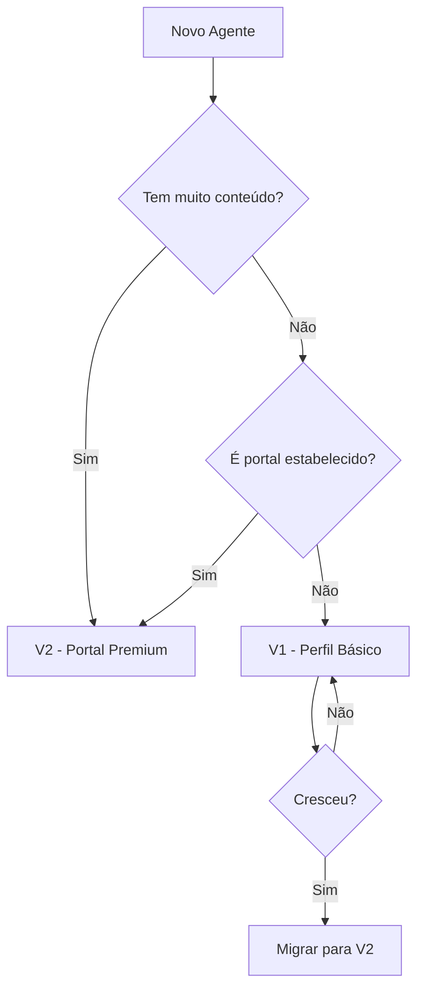

# 🔄 Agent Page: V1 vs V2 - Comparação Completa

## 📊 Visão Geral

| Aspecto | V1 (CommunicationCompanyDetailsPage) | V2 (CommunicationAgentPageV2) |
|---------|--------------------------------------|-------------------------------|
| **Conceito** | Perfil de empresa | Portal editorial territorial |
| **Sensação** | Catálogo/Diretório | Mídia viva e ativa |
| **Foco** | Informações estáticas | Conteúdo dinâmico |
| **Layout** | Tabs simples | Feed editorial premium |
| **Público** | Visitantes casuais | Comunidade engajada |

---

## 🎨 Design & UX

### V1 - Perfil de Empresa
```
❌ Aparência de rede social
❌ Avatar + bio + grid de posts
❌ Tabs básicas (Sobre, Publicações, Territórios)
❌ Layout estático
❌ Pouca hierarquia visual
```

### V2 - Portal Editorial
```
✅ Hero dinâmico com capa forte
✅ Stats bar com indicadores ao vivo
✅ Feed editorial premium
✅ Destaques da semana
✅ Múltiplas seções especializadas
✅ Sidebar contextual rica
✅ Hierarquia visual clara
✅ Sensação de movimento
```

---

## 🏗️ Arquitetura

### V1 - Monolítica
```tsx
CommunicationCompanyDetailsPage.tsx
├── Hero simples
├── Tabs
│   ├── Publicações
│   ├── Sobre
│   └── Territórios
└── Cards básicos
```

### V2 - Modular e Escalável
```tsx
CommunicationAgentPageV2.tsx
├── agent-page/
│   ├── sections/          # 14+ seções especializadas
│   │   ├── Hero
│   │   ├── StatsBar
│   │   ├── WeekHighlights
│   │   ├── LatestPublications
│   │   ├── ActiveCoverage
│   │   ├── LocalNews
│   │   ├── Events
│   │   ├── Multimedia
│   │   ├── CulturalAgenda
│   │   ├── Alerts
│   │   ├── Trending
│   │   ├── Communities
│   │   ├── Partners
│   │   └── EditorialFeed
│   └── sidebar/           # 6+ widgets
│       ├── About
│       ├── Contact
│       ├── Territorial
│       ├── Activity
│       ├── Social
│       └── Newsletter
```

---

## 📱 Componentes Principais

### Hero Section

#### V1
```tsx
// Hero básico
- Avatar médio
- Nome + descrição
- Badges simples
- Botões básicos (Seguir, Salvar, Compartilhar)
```

#### V2
```tsx
// Hero premium
- Background gradiente + pattern
- Avatar grande com verificação destacada
- Badges contextuais (tipo, localização, status)
- CTAs principais (Seguir, Enviar Info, Compartilhar)
- Preview de stats (seguidores, comunidades, publicações)
- Slogan e descrição destacados
```

### Conteúdo Principal

#### V1
```tsx
// Tabs estáticas
<Tabs>
  <Tab name="Publicações">
    <Lista simples de publicações />
  </Tab>
  <Tab name="Sobre">
    <Informações básicas />
    <Estatísticas />
  </Tab>
  <Tab name="Territórios">
    <Grid de territórios />
  </Tab>
</Tabs>
```

#### V2
```tsx
// Feed editorial contínuo
<MainContent>
  <WeekHighlights />        // Destaques em evidência
  <LatestPublications />    // Feed editorial
  <ActiveCoverage />        // Cobertura territorial
  <LocalNews />             // Notícias locais
  <Events />                // Eventos divulgados
  <Trending />              // Conteúdos em alta
  <Multimedia />            // Galeria
  <CulturalAgenda />        // Agenda cultural
  <Alerts />                // Alertas comunitários
  <Communities />           // Comunidades cobertas
  <Partners />              // Parceiros
  <EditorialFeed />         // Feed completo
</MainContent>
```

---

## 📊 Indicadores e Métricas

### V1
```
- Publicações (contador simples)
- Territórios (contador simples)
- Confiabilidade (badge estático)
- Verificação (sim/não)
```

### V2
```
- Seguidores (12.5k) + trend
- Alcance territorial (X comunidades) + status
- Publicações (total + esta semana)
- Eventos divulgados (24 este mês)
- Visualizações (45.2k) + trend
- Engajamento (3.8k) + trend
- Compartilhamentos (1.2k) + trend
- Confiabilidade (score + verificação)
```

---

## 🎯 CTAs (Call to Actions)

### V1
```tsx
<Button>Seguir</Button>
<Button>Salvar</Button>
<Button>Compartilhar</Button>
```

### V2
```tsx
// Hero
<Button primary>Seguir Portal</Button>
<Button secondary>Enviar Informação</Button>
<Button outline>Compartilhar</Button>

// Sidebar
<Button>Enviar Informação</Button>
<Button>WhatsApp</Button>
<Button>Anunciar</Button>
<Button>Newsletter</Button>
```

---

## 🗺️ Rotas

### V1
```
/comunicacao/empresa/:channelSlug
```

### V2
```
/comunicacao/agente/:channelSlug
```

**Ambas coexistem sem conflito!**

---

## 📱 Responsividade

### V1
```
- Grid básico responsivo
- Tabs em mobile
- Cards empilhados
```

### V2
```
- Mobile-first design
- Stats bar com scroll horizontal
- Grid adaptativo avançado
- Sidebar vira bottom em mobile
- Hero otimizado para touch
- Imagens responsivas
- Typography escalável
```

---

## 🎨 Visual Identity

### V1 - Corporativo
```
- Cores neutras
- Layout limpo
- Espaçamento padrão
- Tipografia básica
```

### V2 - Editorial Premium
```
- Gradientes dinâmicos
- Patterns de background
- Espaçamento generoso
- Tipografia hierárquica
- Cores contextuais
- Badges destacados
- Hover effects
- Transições suaves
```

---

## 📊 Dados Exibidos

### V1
```tsx
interface V1Data {
  channel: {
    name: string;
    description: string;
    reliability_score: number;
    verification_status: string;
  };
  publications: Publication[];
  territories: Territory[];
}
```

### V2
```tsx
interface V2Data {
  agent: {
    // Tudo da V1 +
    slogan?: string;
    cover_image?: string;
    social_links?: SocialLinks;
    contact_info?: ContactInfo;
    stats: {
      followers: number;
      views: number;
      engagement: number;
      shares: number;
    };
  };
  publications: Publication[];  // Com mais metadados
  territories: Territory[];      // Com status detalhado
  events: Event[];               // Novo
  highlights: Highlight[];       // Novo
  partners: Partner[];           // Novo
  alerts: Alert[];               // Novo
}
```

---

## 🚀 Performance

### V1
```
- Componente único
- Carregamento simples
- Sem otimizações específicas
```

### V2
```
- Code splitting por seção
- Lazy loading de componentes
- React Query cache
- Imagens otimizadas
- Memoization estratégica
- Infinite scroll preparado
```

---

## 🔮 Futuro

### V1 - Manutenção
```
✅ Mantida para compatibilidade
✅ Uso em contextos simples
✅ Fallback para agentes básicos
```

### V2 - Evolução
```
🚀 Base para futuras features
🚀 Integração com IA territorial
🚀 Live coverage
🚀 Monetização
🚀 Multi-admin
🚀 Analytics avançado
🚀 Push notifications
🚀 Smart distribution
```

---

## 🎯 Quando Usar Cada Uma?

### Use V1 quando:
- ✅ Precisa de página simples e rápida
- ✅ Agente tem poucos dados
- ✅ Foco em informações básicas
- ✅ Compatibilidade com sistemas legados

### Use V2 quando:
- ✅ Agente é portal estabelecido
- ✅ Muito conteúdo para exibir
- ✅ Foco em engajamento
- ✅ Quer sensação premium
- ✅ Precisa de features avançadas
- ✅ Comunidade ativa

---

## 🔄 Migração V1 → V2

### Passo a Passo

1. **Preparar dados:**
```tsx
// Adicionar campos extras ao backend
- slogan
- cover_image
- social_links
- stats (followers, views, etc)
```

2. **Atualizar rota:**
```tsx
// De:
/comunicacao/empresa/:slug

// Para:
/comunicacao/agente/:slug
```

3. **Testar:**
```tsx
// Acessar ambas as rotas
// Comparar experiência
// Validar dados
```

4. **Gradual rollout:**
```tsx
// Começar com agentes premium
// Expandir gradualmente
// Manter V1 como fallback
```

---

## 📈 Métricas de Sucesso

### V1
```
- Pageviews
- Bounce rate
- Time on page
```

### V2
```
- Pageviews
- Bounce rate
- Time on page
- Scroll depth
- Engagement rate
- Click-through rate
- Return visitors
- Newsletter signups
- Content shares
- Territory exploration
```

---

## 🎓 Conclusão

### V1: Perfil Funcional ✅
- Simples e direto
- Informações básicas
- Rápido de implementar
- Bom para começar

### V2: Portal Premium 🚀
- Experiência rica
- Engajamento alto
- Escalável
- Futuro da plataforma

**Ambas têm seu lugar no ecossistema!**

---

## 📞 Decisão de Uso



---

**Desenvolvido para oferecer a melhor experiência em cada contexto!**

*Última atualização: 15/05/2026*
